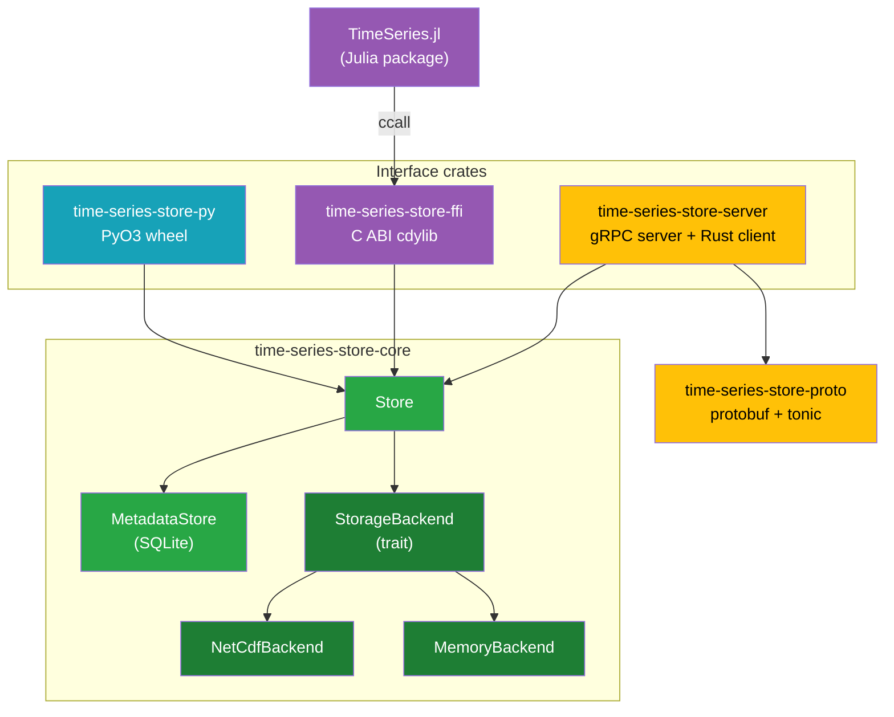
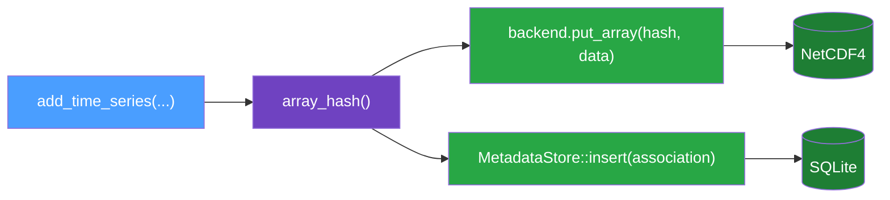
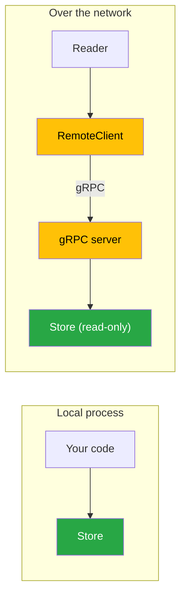

# Architecture

time-series-store is a Rust workspace with one core library and a ring of interface crates around
it. Every interface — native Rust, Python, Julia, and the gRPC server — ultimately drives the same
`Store` type in `time-series-store-core`, and every interface reads and writes the same on-disk
format.

## Crate Layout

| Crate / package            | Role                                                                   |
| -------------------------- | ---------------------------------------------------------------------- |
| `time-series-store-core`   | The whole engine: types, storage backends, hashing, the `Store` API    |
| `time-series-store-proto`  | The `.proto` service compiled with `tonic`; shared message types       |
| `time-series-store-server` | A `tonic` gRPC server wrapping a `Store`, plus an async `RemoteClient` |
| `time-series-store-py`     | PyO3 classes exposing `Store` to Python as the `time_series` module    |
| `time-series-store-ffi`    | A `extern "C"` cdylib with an opaque-handle API over `Store`           |
| `TimeSeries.jl`            | A Julia package that `ccall`s into the FFI cdylib                      |

## The Core: `Store`

`Store` is a thin orchestration layer that composes two collaborators:

- A **`StorageBackend`** that holds the numerical arrays, addressed by content hash.
- A **`MetadataStore`** (SQLite) that holds the associations between owners and arrays.

The backend is chosen behind the [`StorageBackend`](../reference/rust-api.md#storagebackend-trait)
trait. v0 ships two implementations:

- **`MemoryBackend`** — arrays in a hash map; selected when `in_memory = true`. No filesystem I/O.
- **`NetCdfBackend`** — arrays in a NetCDF4 file; selected when a path is given.

Because the seam is a trait, the metadata layer, the hashing, and every binding are identical no
matter where the arrays live. Tests run against the memory backend; production uses NetCDF.

## Why Two Files

Numerical arrays and their descriptive metadata have different access patterns. Arrays are large,
append-mostly, and read by content; metadata is small, frequently queried, and benefits from indexes
and transactions. time-series-store puts each where it is strongest:

- **Arrays → NetCDF4.** Chunked, compressed, columnar storage that HDF5 tooling already understands.
- **Metadata → SQLite.** A queryable, transactional sidecar at `<path>.nc.sqlite`.

The [Storage Model](./storage-model.md) page covers the trade-offs and the consistency protocol that
keeps the two files in agreement.

## Read Paths: Local and Remote

Writes always require local filesystem access — they go straight through a `Store`. Reads can happen
two ways:

The gRPC server exposes a **read-only** subset of the API (list, get, keys, resolutions, counts,
existence checks, integrity). It never writes. See [Language Bindings](./bindings.md) and the
[gRPC Server guide](../guides/server.md).

## Concurrency

Within a process, `NetCdfBackend` guards its NetCDF handle with a `Mutex`, so the backend is
`Send +
Sync` and a `Store` can be shared across threads. The metadata `MetadataStore` wraps a single
SQLite connection and uses transactions for atomic multi-row writes. The library does not coordinate
multiple processes writing the same file concurrently — a single writer owns the files at a time.
