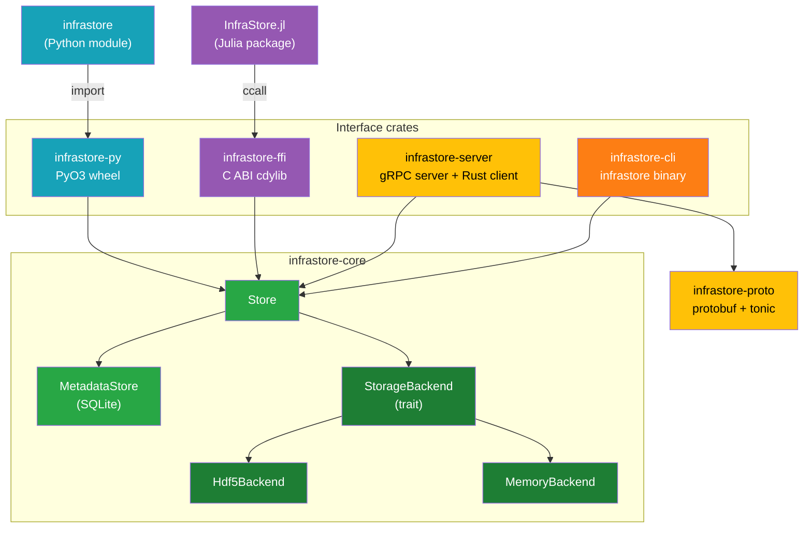
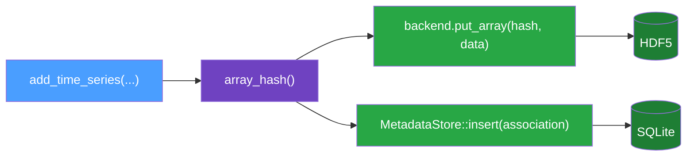
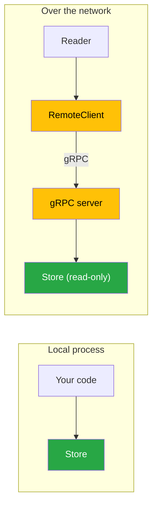

# Architecture

infrastore is a Rust workspace with one core library and a ring of interface crates around it. Every
interface — native Rust, Python, Julia, the `infrastore` CLI, and the gRPC server — ultimately
drives the same `Store` type in `infrastore-core`, and every interface reads and writes the same
on-disk format.

## Crate Layout

| Crate / package     | Role                                                                           |
| ------------------- | ------------------------------------------------------------------------------ |
| `infrastore-core`   | The whole engine: types, storage backends, hashing, the `Store` API            |
| `infrastore-proto`  | The `.proto` service compiled with `tonic`; shared message types               |
| `infrastore-server` | A `tonic` gRPC server wrapping a `Store`, plus an async `RemoteClient`         |
| `infrastore-py`     | PyO3 classes exposing `Store` as the `infrastore` module                       |
| `infrastore`        | The importable Python module — user-facing surface of the PyO3 wheel           |
| `infrastore-ffi`    | A `extern "C"` cdylib with an opaque-handle API over `Store`                   |
| `InfraStore.jl`     | A Julia package that `ccall`s into the FFI cdylib                              |
| `infrastore-cli`    | The `infrastore` binary: read+write access to an on-disk store from a terminal |
| `infrastore-bench`  | The `infrastore-bench` binary: ingestion and simulation-read benchmarks        |

## The Core: `Store`

`Store` is a thin orchestration layer that composes two collaborators:

- A **`StorageBackend`** that holds the numerical arrays, addressed by content hash.
- A **`MetadataStore`** (SQLite) that holds the associations between owners and arrays.

The backend is chosen behind the [`StorageBackend`](../reference/rust-api.md#storagebackend-trait)
trait. There are two implementations:

- **`MemoryBackend`** — arrays in a hash map; selected when `in_memory = true`. No filesystem I/O.
- **`Hdf5Backend`** — arrays in an HDF5 file; selected when a path is given.

Because the seam is a trait, the metadata layer, the hashing, and every binding are identical no
matter where the arrays live. Tests run against the memory backend; production uses HDF5.

## Why Two Files

Numerical arrays and their descriptive metadata have different access patterns. Arrays are large,
append-mostly, and read by content; metadata is small, frequently queried, and benefits from indexes
and transactions. infrastore puts each where it is strongest:

- **Arrays → HDF5.** Chunked, compressed, columnar storage that the whole HDF5 ecosystem reads.
- **Metadata → SQLite.** A queryable, transactional catalog at `<path>.h5.sqlite`.

The [Storage Model](./storage-model.md) page covers the trade-offs and the consistency protocol that
keeps the two files in agreement.

## Read Paths: Local and Remote

Writes always require local filesystem access — they go straight through a `Store`. Reads can happen
two ways:

The gRPC server exposes a **read-only** subset of the API (list, get, keys, resolutions, counts,
existence checks, integrity). It never writes. See [Language Bindings](./bindings.md) and the
[gRPC Server guide](../guides/server.md).

## Concurrency

Within a process, `Hdf5Backend` guards its HDF5 handle with a `Mutex`, so the storage backend itself
is `Send + Sync`. The `Store` as a whole, however, is **`Send` but not `Sync`**: its `MetadataStore`
wraps a single `rusqlite::Connection`, which is internally a `RefCell` and therefore cannot be
shared between threads. In practice this means a `Store` can be **moved** to another thread, but
sharing one across threads requires external synchronization — the gRPC server holds its store as an
`Arc<Mutex<Store>>`, and the PyO3 binding marks the class `unsendable` so a Python `Store` stays on
the thread that created it.

`MetadataStore` uses transactions for atomic multi-row writes. The library does not coordinate
multiple processes writing the same file concurrently — a single writer owns the files at a time.

Within one process the rule is enforced: opening an artifact that another `Store` in the process
already holds — read-only or not — fails with `StoreInUse`, and so do `create_replacing`,
`open_without_catalog`, `persist_to`, and `persist_arrays_to` aimed at a held path. Each handle
indexes the HDF5 file's packed columns once at open, and libhdf5 shares one file object between two
opens of a file, so a second handle would read and write the wrong columns. Drop the handle before
opening another.
