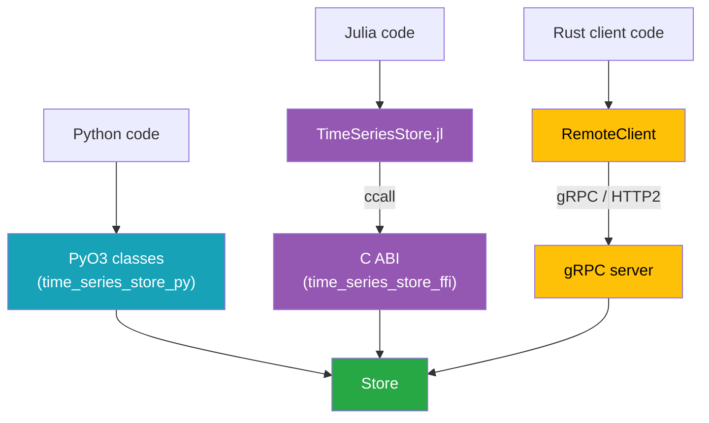

# Language Bindings

Every interface wraps the same `Store`. Understanding how each binding bridges to the core explains
why the APIs look the way they do, how errors propagate, and what each layer owns.

## Python (PyO3)

`time-series-store-py` uses [PyO3](https://pyo3.rs) to expose `Store` as native Python classes in a
module importable as `time_series_store`. The binding:

- Converts Python `datetime`/`timedelta` to `chrono` types and NumPy arrays (any shape) to
  `TypedArray`s at the boundary, supporting the full dtype set (`f64`, `f32`, `i64`, `i32`, `u64`,
  `bool`).
- Translates the typed `TimeSeriesError` variants into a Python exception hierarchy rooted at
  `TimeSeriesError` (`NotFoundError`, `DuplicateTimeSeriesError`, `InvalidParameterError`,
  `IntegrityError`, `ReadOnlyStoreError`).
- Builds an `abi3-py310` wheel, so one wheel works across CPython 3.10+ without recompiling.

The metadata side is owned entirely by Rust; Python never touches SQLite directly. See the
[Python guide](../guides/python.md) and [Python API reference](../reference/python-api.md).

## Julia (C ABI)

Julia does not call Rust directly. Instead, `time-series-store-ffi` compiles a C-compatible cdylib
with an opaque-handle API, and `TimeSeriesStore.jl` `ccall`s into it.

The conventions that shape the Julia API:

- **Opaque handles.** `TsStore` and `TsKey` are pointers; the Julia structs wrap them and register
  finalizers (`close!`, `_finalize_key`) that call the matching `ts_*_free` function.
- **Status codes plus thread-local error messages.** Every C function returns an `int32_t` code. On
  a non-zero code, Julia calls `ts_last_error_message` to retrieve the detail string and raises the
  matching Julia exception type.
- **Out-parameters and caller-owned buffers.** Arrays come back through an out-pointer plus a length
  and a dtype code; Julia copies them into a `Vector{T}` for the requested element type and frees
  the Rust buffer with `ts_buffer_free_f64` / `ts_buffer_free_u8` / `ts_buffer_free_i64`.
- **Features cross as JSON.** Julia serializes the feature dict to a JSON string, which the FFI
  layer parses into a `Features` map.
- **Forecasts are wrapped.** `TimeSeriesStore.jl` exposes `Deterministic` / `Probabilistic` /
  `Scenarios` structs passed to the generic `add_time_series!`, type-dispatched
  `get_time_series(Type, …)` getters, and `transform_single_time_series!`, so all four forecast
  types are usable from Julia.
- **Bulk reads use a result handle.** `bulk_read` reads many full `SingleTimeSeries` at once: the
  FFI fetches them in one decompress-once pass per dataset into a `TsBulkReadHandle`
  (`ts_store_bulk_read_single`), and Julia reads each element out, then frees the handle. Python's
  `store.bulk_read` exposes the same operation directly. Managed bulk _writes_ already take the fast
  block-write path through the existing batch / `add_time_series_bulk` APIs.

`TimeSeriesStore.jl` loads the cdylib from the path in the `TIME_SERIES_STORE_LIB` environment
variable. See the [Julia guide](../guides/julia.md), the [C ABI reference](../reference/c-abi.md),
and the [Julia API reference](../reference/julia-api.md).

### InfrastructureSystems.jl Integration

The model was shaped to drop into InfrastructureSystems.jl: owners are identified by integer
component identifiers (`i64`), owner categories map to `Component` / `SupplementalAttribute`, and
features accept string values so InfrastructureSystems.jl's feature dictionaries round-trip
unchanged. The FFI exposes attribute-based metadata accessors (`ts_store_get_metadata`,
`ts_store_has_by_attrs`, `ts_store_remove_by_attrs`) and a hash-based array fetch
(`ts_store_get_array_by_hash`) so an InfrastructureSystems.jl-side store can keep its own key
objects and reach the array layer directly.

## gRPC Server and Client

`time-series-store-server` wraps a `Store` in a `tonic` gRPC service generated from
`time-series-store-proto`. It exposes a **read-only** slice of the API and adds optional API-key
auth. The matching async `RemoteClient` mirrors the read methods and maps gRPC `Status` codes back
to `TimeSeriesError::ConnectionError`, so remote calls surface the same error type as local ones.

Writes are deliberately not exposed over gRPC — they require local filesystem access. The server is
for fan-out reads of an existing store. See the [gRPC Server guide](../guides/server.md) and the
[gRPC API reference](../reference/grpc-api.md).

## CLI (`tss`)

`time-series-store-cli` builds the `tss` binary, a thin wrapper over the core `Store` for use from a
terminal. Unlike the gRPC server it is **not** read-only: it opens the on-disk `.nc` + `.nc.sqlite`
pair directly and supports both reads and writes. Its shape:

- **CSV in, store out.** Numeric values come from a CSV; the metadata that does not fit a flat grid
  (owner, name, type, dtype, resolution, timestamps, units, features) is described in a descriptor
  JSON. All six dtypes and all five writable types are supported, forecasts included.
- **Output mirrors `torc`.** A global `-f/--format` selects `table` (default), `json`, or `csv`,
  matching the conventions of the sibling `torc` CLI.
- **Store access is isolated.** All store opening lives behind one module, so a future remote/gRPC
  mode can be added without touching the command handlers; today there is no remote mode.

See the [Use the `tss` CLI how-to](../how-to/use-cli.md) and the
[CLI reference](../reference/cli.md).

## What Every Binding Shares

| Concern            | Single source of truth                                             |
| ------------------ | ------------------------------------------------------------------ |
| Types & validation | `time-series-store-core` (`Store`, `TimeSeriesKey`, `Features`)    |
| On-disk format     | `NetCdfBackend` + `MetadataStore` — identical regardless of caller |
| Hashing            | `array_hash` / `features_hash` — the cross-language contract       |
| Error taxonomy     | `TimeSeriesError`, re-projected into each language's idiom         |

A file written by Python reads identically from Julia, Rust, or the server, because none of the
bindings reimplement storage — they all funnel through the one core.

## Feature Coverage Varies by Binding

The bindings funnel through one core, and the surface is now broadly consistent. Both static series
types are available everywhere (read+write, except the read-only gRPC server), and
[forecasts](./data-model.md#forecasts) read back across every interface. The remaining asymmetry is
that the read-only gRPC server does not accept any writes:

| Capability                    | Rust core | C ABI | Python | Julia | gRPC        |
| ----------------------------- | --------- | ----- | ------ | ----- | ----------- |
| `SingleTimeSeries` r/w        | ✅        | ✅    | ✅     | ✅    | read-only   |
| `NonSequentialTimeSeries` r/w | ✅        | ✅    | ✅     | ✅    | read-only   |
| dtypes beyond `f64`           | ✅        | ✅    | ✅     | ✅    | read-only   |
| Create forecasts              | ✅        | ✅    | ✅     | ✅    | ❌          |
| Read forecast values          | ✅        | ✅    | ✅     | ✅    | ✅          |
| Forecast metadata / counts    | ✅        | ✅    | ✅     | ✅    | list/counts |

The only gap is by design: writes (including forecasts added through `add_time_series`) require
local filesystem access, so the read-only gRPC server serves forecast reads but not writes.
