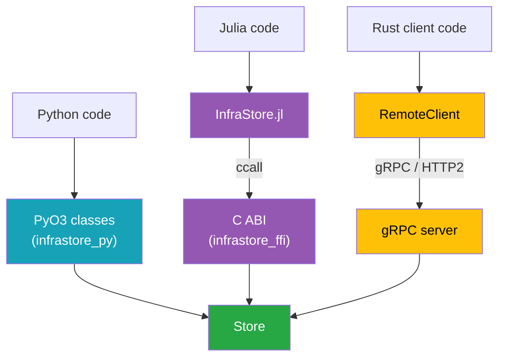

# Language Bindings

Every interface wraps the same `Store`. Understanding how each binding bridges to the core explains
why the APIs look the way they do, how errors propagate, and what each layer owns.

## Python (PyO3)

`infrastore-py` uses [PyO3](https://pyo3.rs) to expose `Store` as native Python classes in a module
importable as `infrastore`. The binding:

- Converts Python `datetime`/`timedelta` to `chrono` types and NumPy arrays (any shape) to
  `TypedArray`s at the boundary, supporting the full dtype set (`f64`, `f32`, the integer widths,
  `bool`).
- Translates the typed `TimeSeriesError` variants into a Python exception hierarchy rooted at
  `TimeSeriesError` (`NotFoundError`, `DuplicateTimeSeriesError`, `InvalidParameterError`,
  `IntegrityError`, `ReadOnlyStoreError`).
- Builds an `abi3-py311` wheel, so one wheel works across CPython 3.11+ without recompiling.
- Converts a static series to a `pyarrow.Table` with `to_arrow()`, behind the optional `arrow`
  extra. This is the one place a binding reaches past numpy, and it is optional for that reason:
  pyarrow is several times the size of the wheel that would pull it in. What makes Arrow worth the
  seam is that its `timestamp(unit, tz)` is the same shape as the store's own model — an instant
  plus the spelling it was written in — so a table keeps a distinction pandas would flatten.

The metadata side is owned entirely by Rust; Python never touches SQLite directly. See the
[Python guide](../guides/python.md) and [Python API reference](../reference/python-api.md).

## Julia (C ABI)

Julia does not call Rust directly. Instead, `infrastore-ffi` compiles a C-compatible cdylib with an
opaque-handle API, and `InfraStore.jl` `ccall`s into it.

The conventions that shape the Julia API:

- **Opaque handles.** `InfraStore` and `InfraStoreKey` are pointers; the Julia structs wrap them and
  register finalizers (`close!`, `_finalize_key`) that call the matching `ts_*_free` function.
- **Status codes plus thread-local error messages.** Every C function returns an `int32_t` code. On
  a non-zero code, Julia calls `infrastore_last_error_message` to retrieve the detail string and
  raises the matching Julia exception type.
- **Out-parameters and caller-owned buffers.** Arrays come back through an out-pointer plus a length
  and a dtype code; Julia copies them into a `Vector{T}` for the requested element type and frees
  the Rust buffer with the deallocator matching the buffer's element type —
  `infrastore_buffer_free_f64`, `infrastore_buffer_free_u8`, `infrastore_buffer_free_i64`, or
  `infrastore_buffer_free_u64` (shape/dims buffers).
- **Features cross as JSON.** Julia serializes the feature dict to a JSON string, which the FFI
  layer parses into a `Features` map.
- **Forecasts are wrapped.** `InfraStore.jl` exposes `Deterministic` / `Probabilistic` / `Scenarios`
  structs passed to the generic `add_time_series!`, id-addressed `read_by_id` getters, and
  `transform_single_time_series!`, so all four forecast types are usable from Julia.
- **Bulk reads use a result handle.** `read_by_ids` reads many full `SingleTimeSeries` at once: the
  FFI fetches them in one decompress-once pass per dataset into a `InfraStoreBulkReadHandle`
  (`infrastore_store_bulk_read_single`), and Julia reads each element out, then frees the handle.
  Python's `store.read_by_ids` exposes the same operation directly. `read_by_ids` addresses the same
  read by catalog association id and fills the same handle, so both reads decode by the same route:
  `infrastore_bulk_result_item_name` hands each item's name back beside its values, as
  `infrastore_bulk_result_item_type` does its type. Managed bulk _writes_ already take the fast
  block-write path through the existing batch / `add_time_series_bulk` APIs.

`InfraStore.jl` loads the cdylib from the `INFRASTORE_LIB` environment variable when it is set, and
otherwise from the `libinfrastore_ffi` artifact its `Artifacts.toml` pins to the matching GitHub
Release (see [Integrate with Julia](../guides/julia.md#install)). See the
[Julia guide](../guides/julia.md), the [C ABI reference](../reference/c-abi.md), and the
[Julia API reference](../reference/julia-api.md).

### InfrastructureSystems.jl Integration

The model was shaped to drop into InfrastructureSystems.jl: owners are identified by integer
component identifiers (`i64`), owner categories map to `Component` / `SupplementalAttribute`, and
features accept string values so InfrastructureSystems.jl's feature dictionaries round-trip
unchanged. The FFI exposes attribute-based accessors (`infrastore_store_has_by_attrs`,
`infrastore_store_remove_by_ids`), a whole-record metadata read
(`infrastore_store_get_metadata_by_key`, reachable from attributes through
`infrastore_store_list_metadata`), and a hash-based array fetch
(`infrastore_store_get_array_by_hash`) so an InfrastructureSystems.jl-side store can keep its own
key objects and reach the array layer directly.

## gRPC Server and Client

`infrastore-server` wraps a `Store` in a `tonic` gRPC service generated from `infrastore-proto`. It
exposes a **read-only** slice of the API and adds optional API-key auth. The matching async
`RemoteClient` mirrors the read methods and maps gRPC `Status` codes back to
`TimeSeriesError::ConnectionError`, so remote calls surface the same error type as local ones.

Writes are deliberately not exposed over gRPC — they require local filesystem access. The server is
for fan-out reads of an existing store. See the [gRPC Server guide](../guides/server.md) and the
[gRPC API reference](../reference/grpc-api.md).

## CLI (`infrastore`)

`infrastore-cli` builds the `infrastore` binary, a thin wrapper over the core `Store` for use from a
terminal. Unlike the gRPC server it is **not** read-only: it opens the on-disk `.h5` + `.h5.sqlite`
pair directly and supports both reads and writes. Its shape:

- **CSV in, store out.** Numeric values come from a CSV; the metadata that does not fit a flat grid
  (owner, name, type, dtype, resolution, timestamps, units, features) is described in a descriptor
  JSON. All six dtypes and all six writable types are supported, forecasts included.
- **A global `-f/--format` selects `table` (default), `json`, `jsonl`, or `csv`.** Read commands
  render their results in it; write commands report their outcome in it (prose under `table`, a
  one-object status document under `json`/`jsonl`). Only `template` ignores it.
- **Store access is isolated.** All store opening lives behind one module, so a future remote/gRPC
  mode can be added without touching the command handlers; today there is no remote mode.

See the [CLI guide](../guides/cli.md) and the [CLI reference](../reference/cli.md).

## What Every Binding Shares

| Concern            | Single source of truth                                           |
| ------------------ | ---------------------------------------------------------------- |
| Types & validation | `infrastore-core` (`Store`, `TimeSeriesId`, `Features`)          |
| On-disk format     | `Hdf5Backend` + `MetadataStore` — identical regardless of caller |
| Hashing            | `array_hash` / `features_hash` — the cross-language contract     |
| Error taxonomy     | `TimeSeriesError`, re-projected into each language's idiom       |

A file written by Python reads identically from Julia, Rust, or the server, because none of the
bindings reimplement storage — they all funnel through the one core.

## Feature Coverage Varies by Binding

The bindings funnel through one core, and the surface is now broadly consistent. Both static series
types are available everywhere (read+write, except the read-only gRPC server), and
[forecasts](./time-series-types.md#forecasts) read back across every interface. The remaining
asymmetry is that the read-only gRPC server does not accept any writes:

| Capability                    | Rust core | C ABI | Python          | Julia | CLI          | gRPC        |
| ----------------------------- | --------- | ----- | --------------- | ----- | ------------ | ----------- |
| `SingleTimeSeries` r/w        | ✅        | ✅    | ✅              | ✅    | ✅           | read-only   |
| `NonSequentialTimeSeries` r/w | ✅        | ✅    | ✅              | ✅    | ✅           | read-only   |
| `PersistentTimeSeries` r/w    | ✅        | ✅    | ✅              | ✅    | ✅           | read-only   |
| dtypes beyond `f64`           | ✅        | ✅    | ✅              | ✅    | ✅           | read-only   |
| Create forecasts              | ✅        | ✅    | ✅              | ✅    | ✅           | ❌          |
| Read forecast values          | ✅        | ✅    | ✅              | ✅    | ✅           | ✅          |
| Forecast metadata / counts    | ✅        | ✅    | ✅              | ✅    | ✅           | list/counts |
| Readers (columnar sweep)      | ✅        | ✅    | ✅              | ✅    | `grid`       | ❌          |
| Association catalogs          | ✅        | ✅    | ✅              | ✅    | ✅           | ❌          |
| Store attributes              | ✅        | ✅    | ✅              | ✅    | `store-attr` | read-only   |
| Materialized timestamps       | ✅        | ✅    | ✅              | ✅    | ✅           | ❌          |
| `from_timestamps` (verified)  | ✅        | ✅    | ✅              | ✅    | ❌           | ❌          |
| Arrow tables (`to_arrow`)     | ❌        | ❌    | ✅              | ❌    | ❌           | ❌          |
| Parquet files                 | crate     | ❌    | via `to_arrow`  | ❌    | `-f parquet` | ❌          |
| Store summary (`show`)        | ❌        | ❌    | ✅              | ❌    | `store-info` | ❌          |
| Forecast windows as Arrow     | ❌        | ❌    | `Deterministic` | ❌    | ❌           | ❌          |

The only gap is by design: writes (including forecasts added through `add_time_series`) require
local filesystem access, so the read-only gRPC server serves forecast reads but not writes.

**`show()`** is Python-only for now: it is a REPL affordance, and the REPL each binding is used from
already has one of its own — Julia has `Base.show`, and the CLI has `store-info` plus the `list`
family. It composes existing catalog aggregate queries and adds no core API, so any binding that
wants it can grow one without a change underneath.

**Parquet** lives in a crate of its own, `infrastore-parquet`, which the CLI depends on behind a
cargo feature that is **off by default** — Arrow is a large dependency tree nothing else in the
project needs, and `deny.toml` makes every dependency a policy decision. The CLI is the only surface
that reads and writes Parquet _files_ (`export -f parquet`, `add --parquet`). Python reaches the
same files through `to_arrow()` / `from_arrow` plus `pyarrow.parquet`, and the table those produce
is deliberately identical to the one the CLI writes — one schema, two producers — so a file moves
between them without changing meaning. Nothing else has it: the C ABI and Julia would need the whole
Arrow tree in the cdylib for a format their host languages already have readers for, and the gRPC
server serves values, not files.

**Materialized timestamps** and **`from_timestamps`** both run in the core and reach Julia through
two stateless ABI entry points, `infrastore_grid_timestamps` and `infrastore_infer_period`. That
matters more than it looks: Julia is the one binding whose date library has calendar arithmetic of
its own, and whose TimeZones overload steps a _local_ clock the core deliberately does not — so a
binding-side reimplementation would agree with the core only by luck. There is one implementation of
"which instants does this series contain" in the project, and it is `Period::add_to`. **Arrow
tables** are Python-only because Arrow is where the Python data ecosystem meets; the Julia
counterpart would be a `Tables.jl` interface, which is a different contract and not yet asked for. A
`Deterministic` converts through `to_arrow_windows()` into one table per window rather than one
table, because its two grids — windows stepping by `interval`, rows stepping by `resolution` —
overlap; `Probabilistic` and `Scenarios` wait on a decision about how to spell their third axis.
