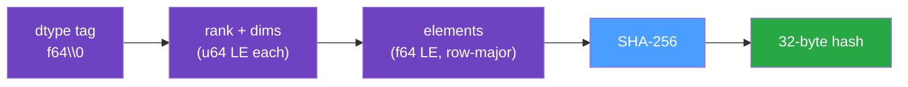

# Content Addressing

Every array is identified by the SHA-256 hash of its contents, not by a name or an ID. Two series
with byte-identical values therefore resolve to the same hash and are stored exactly once. This is
the mechanism that lets many [keys](./data-model.md#keys) share one underlying array.

## The Array Hash

`array_hash` produces a deterministic 32-byte digest from an `ArrayD<f64>`. The hashed byte stream
is, in order:

1. A **dtype tag**, `b"f64\0"` (the only element type supported today).
2. The **shape**: the rank as a little-endian `u64`, then each dimension as a little-endian `u64`.
3. The **elements** in row-major order, each as `f64::to_le_bytes`.



Two consequences worth calling out:

- **Shape is part of the identity.** A flat 4-element array and a 2×2 array with the same values
  hash differently. Reshaping changes the hash.
- **`NaN` is canonicalized.** Any `NaN`, regardless of its payload bits, is hashed as a single
  canonical quiet-`NaN` pattern. Semantically equal arrays never collide on `NaN` representation,
  and equality of hash matches equality of values.

## The Features Hash

Feature maps are hashed by `features_hash` with the same discipline: a domain tag, the entry count,
then, in the `BTreeMap`'s sorted-by-key order, a length-prefixed key plus a kind tag and the value
bytes for each entry. Because the map is always sorted, insertion order does not affect the hash:

```python
{"model_year": 2030, "scenario": 1}   # hashes identically to
{"scenario": 1, "model_year": 2030}
```

The features hash is stored in the `features_hash` column and is part of the metadata uniqueness
index — it is how the database distinguishes two otherwise-identical associations that differ only
in their features.

## Deduplication on Write

When you add a series, `Store` hashes the array and asks the backend whether that hash is already
present:

- **Present** → the existing column is reused; no new array bytes are written. Only a new metadata
  association row is inserted.
- **Absent** → the array is written to the first free column of a compatible
  `sts_{length}_{resolution}` dataset, and the hash is recorded in the companion hash variable.

So storage cost scales with the number of _distinct_ arrays, while metadata cost scales with the
number of _associations_. A profile shared by a thousand generators costs one array and a thousand
small rows.

## Deletion is Reference-Counted

Because arrays are shared, deleting an association cannot blindly delete its array. On
`remove_time_series` (and `clear_time_series`), `Store`:

1. Deletes the matching association rows inside a SQLite transaction, collecting their
   `data_hash`es.
2. For each freed hash, counts how many associations still reference it.
3. Only frees the NetCDF column for hashes whose reference count has dropped to zero.

This keeps shared arrays alive until the last referencing key is gone.

## Stability is a Contract

These hashes are part of the on-disk format. The `hash_golden` integration test pins the SHA-256 of
representative inputs; any change to the hashing domain that perturbs those values is a
format-breaking change and must bump
[`DATA_FORMAT_VERSION`](../reference/file-format.md#format-version). Treat the hashing rules above
as fixed, not as an implementation detail.

## Integrity Verification

Because the stored hash and the stored data are independent on disk, they can be cross-checked.
`verify_integrity` walks every indexed column, recomputes `array_hash` from the stored values, and
reports any mismatch between the recorded hash and the recomputed one — detecting silent corruption.
See [`verify_integrity`](../reference/rust-api.md#store).
