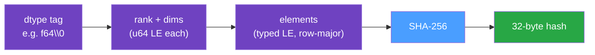

# Content Addressing

Every array is identified by the SHA-256 hash of its contents, not by a name or an ID. Two series
with byte-identical values therefore resolve to the same hash and are stored exactly once. This is
the mechanism that lets many [keys](./data-model.md#keys) share one underlying array.

## The Array Hash

`array_hash` produces a deterministic 32-byte digest from a
[`TypedArray`](./data-model.md#typed-n-dimensional-arrays). The hashed byte stream is, in order:

1. A **dtype tag**: the dtype name (`f64`, `f32`, `i64`, `i32`, `u64`, `bool`) followed by a NUL
   byte.
2. The **shape**: the rank as a little-endian `u64`, then each dimension as a little-endian `u64`.
3. The **elements** in row-major order. Float dtypes canonicalize `NaN` to a single quiet-`NaN` bit
   pattern before hashing; integer and `bool` bytes are hashed verbatim.



Identity is therefore `(dtype, shape, content)`:

- **dtype and shape are part of the identity.** Two arrays with the same numbers but a different
  dtype, or a different shape, never collide. Reshaping or retyping changes the hash.
- **`NaN` is canonicalized** (float dtypes only). Any `NaN`, regardless of its payload bits, hashes
  as a single canonical quiet-`NaN` pattern, so semantically equal float arrays never collide on
  `NaN` representation.

## The Features Hash

Feature maps are hashed by `features_hash` with the same discipline: a domain tag, the entry count,
then, in the `BTreeMap`'s sorted-by-key order, a length-prefixed key plus a kind tag and the value
bytes for each entry. Because the map is always sorted, insertion order does not affect the hash:

```python
{"model_year": 2030, "scenario": 1}   # hashes identically to
{"scenario": 1, "model_year": 2030}
```

The features hash does double duty in the catalog:

- **It identifies the association.** It is stored in the `features_hash` column and is part of the
  metadata uniqueness index — it is how the database distinguishes two otherwise-identical
  associations that differ only in their features.
- **It _is_ the key of the feature set.** The `feature_sets` table is keyed by
  `(features_hash, key)`, so a feature map is content-addressed exactly as an array is: stored
  **once** and shared by every association whose hash matches. The association row already carries
  that hash, so no join column, foreign key, or association id is needed. An empty map stores no
  rows at all.

Sharing is not a rare case, it is the common one. Thousands of components typically carry the same
feature set (often the empty one, or a single scenario tag), and it collapses to one copy. The
sharpest example is a `DeterministicSingleTimeSeries`: it is a view over the `SingleTimeSeries` it
was derived from and has exactly the same features, so `transform_single_time_series` writes
**zero** feature rows — it reuses the set the source series already stored, just as it reuses the
source's array.

## Deduplication on Write

Both hashes deduplicate, by the same mechanism, on the same write.

**The array.** `Store` hashes the array and asks the backend whether that hash is already present:

- **Present** → the existing array is reused; no new array bytes are written. Only a new metadata
  association row is inserted.
- **Absent** → the array is written. A packed array (`SingleTimeSeries`) goes into the first free
  column of a compatible `sts_{dtype}_{shape}_{length}_{res}` dataset, recording its hash in the
  companion hash variable; a standalone array (`NonSequentialTimeSeries`, dense forecasts) becomes a
  new `arr_{hash}` variable.

**The feature set.** The association insert (`MetadataStore::insert_batched`) writes the feature set
under its hash with an `INSERT OR IGNORE`, so a set some other association already stored is a no-op
— equal hash implies equal set, so an ignored conflict cannot hide a _different_ set behind the same
hash. Within one batch a `FeatureSetCache` remembers the sets already written, so a bulk add issues
one write per _distinct_ set rather than a no-op statement per row per feature. This is what keeps a
transform flat in feature count instead of linear in it.

So storage cost scales with the number of _distinct_ arrays and _distinct_ feature sets, while
metadata cost scales with the number of _associations_. A profile shared by a thousand generators
costs one array, one feature set, and a thousand small rows.

## Deletion is Reference-Counted

Because arrays are shared, deleting an association cannot blindly delete its array. On
`remove_time_series` (and `clear_time_series`), `Store`:

1. Deletes the matching association rows inside a SQLite transaction, collecting their
   `data_hash`es.
2. For each freed hash, counts how many associations still reference it.
3. Only frees the NetCDF column for hashes whose reference count has dropped to zero.

This keeps shared arrays alive until the last referencing key is gone.

### Feature sets are the deliberate exception

Feature sets are shared by the same mechanism but are **not** reference-counted, and the symmetry
stops there. Counting references on every delete would make deletion pay for a scan the array side
already pays for, to reclaim a handful of tiny rows; the schema instead accepts unreachable rows and
sweeps them in bulk. Concretely:

- **No foreign key, no `ON DELETE CASCADE`.** A cascade would be actively wrong: rows are shared, so
  deleting one association must not delete a set another association still uses.
- **Deleting the last user leaves the set unreachable**, rather than deleting it — the same
  end-state as the NetCDF side's dead standalone variables, which also linger.
- **`Store::compact` sweeps them.** It deletes every feature set no association references any more
  and reports the row count as `feature_sets_reclaimed`. This is the one thing compaction physically
  removes.
- **Clearing the whole store drops them all outright**, since a cleared store orphans every set by
  construction and may never see a compaction.

The practical consequence: an unreachable feature set is never _read_ (every lookup goes through an
association's `features_hash`), so it costs bytes, not correctness — and a re-added association with
the same features silently adopts the row that was still sitting there.

## Discovering Shared Series

Sharing is observable on read, not just an internal write optimization. Every metadata row carries
its array's `data_hash`, so a caller can group series by that hash to learn which ones resolve to
the same stored array — without reading any array bytes. Two cases land in the same group: arrays
that were deduplicated because their content was identical, and a `SingleTimeSeries` together with
any `DeterministicSingleTimeSeries` derived from it (the DST shares the backing array).

In the Julia binding, `list_array_groups` returns the `list_keys` rows plus a `data_hash` field (a
64-character hex string); group by it to find the shared sets. `count_array_references` reports, for
one hash, how many `SingleTimeSeries` and `DeterministicSingleTimeSeries` associations point at it.

```julia
groups = Dict{String, Vector{NamedTuple}}()
for row in list_array_groups(store)
    push!(get!(groups, row.data_hash, eltype(values(groups))[]), row)
end
shared = filter(((_, rows),) -> length(rows) > 1, groups)   # arrays referenced by >1 series
```

This read-side view is what lets a downstream caller collapse work across owners that share data.
The [`ForecastReader`](../reference/julia-api.md#forecastreader) builds on the same grouping
internally: forecasts that share an array (and read plan) are read from disk **once per timestamp**
no matter how many components reference them — see
[Window-read deduplication](../reference/julia-api.md#window-read-deduplication). (This is exactly
how InfrastructureSystems.jl backs its own `get_shared_time_series` and forecast reader.)

## Stability is a Contract

These hashes are part of the on-disk format. Any change to a hashing domain above that perturbs a
stored hash is a format-breaking change and must bump
[`DATA_FORMAT_VERSION`](../reference/file-format.md#format-version). Treat the hashing rules above
as fixed, not as an implementation detail.

The `golden_hash_pin` integration test guards the array domain by pinning the exact SHA-256 of one
fixed input (an `f64` array of `[0, 1, 2, 3]`). That is a tripwire, not a proof: it covers a single
dtype, shape, and value set, and it does not pin `features_hash` at all. A change to the hashing
rules can therefore break the format without breaking that test — the reasoning above, not the test,
is the contract.

## Integrity Verification

Because the stored hash and the stored data are independent on disk, they can be cross-checked.
`verify_integrity` walks every indexed column, recomputes `array_hash` from the stored values, and
reports any mismatch between the recorded hash and the recomputed one — detecting silent corruption.
See [`verify_integrity`](../reference/rust-api.md#store).

### What it does not cover

The check is scoped to the **array half** of the store. It reads what the NetCDF side knows about
and rehashes it; it never opens the SQLite catalog. A clean report is therefore a statement about
the arrays, not about the store as a whole. Three things fall outside it:

- a `data_hash` in the catalog that names no stored array — a truncated or corrupted catalog, or a
  catalog paired with the wrong `.nc` file. Every read of the affected key fails, and
  `verify_integrity` reports nothing.
- a catalog row whose `dtype`, `element_shape`, or `length` misdescribes the array it points at.
- a missing catalog entirely. The two artifacts are one logical store, but nothing enforces that:
  opening read-write with the `.sqlite` half deleted silently recreates it empty, and the resulting
  store — zero time series, every array still present and now unreachable — verifies clean.

This is a deliberate scope rather than an oversight: the array side is where silent bit-level
corruption happens, and it is the half no other call examines. The catalog has its own purpose-built
checks — `check_static_consistency` for per-resolution grid agreement, and `compact` for the
unreachable arrays and feature sets a delete leaves behind (an expected state, documented in the
[file format](../reference/file-format.md), not corruption). SQLite also enforces a good deal
itself: the `NOT NULL` and `CHECK` constraints, and the two unique indexes that guarantee identity
uniqueness.

If you need end-to-end assurance that a copied or restored store is intact, the operational rule in
the [file format](../reference/file-format.md) is the one that matters: move, copy, and delete the
`.nc` and its `.sqlite` together.
