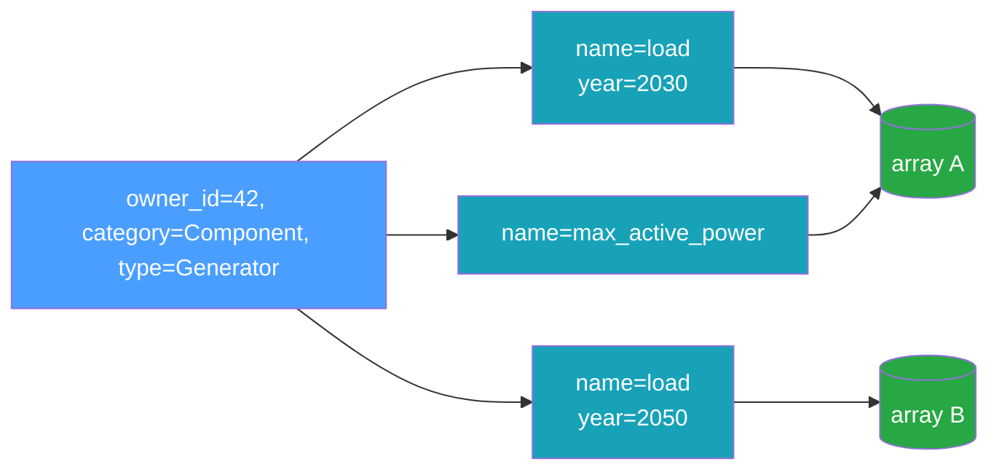

# Data Model

The data model mirrors the time-series concepts originally developed in
[InfrastructureSystems.jl](https://github.com/NREL-Sienna/InfrastructureSystems.jl): a **component**
(or supplemental attribute) owns one or more named time series, and each time series may exist in
several variants distinguished by **features**.

## Owners

Every time series belongs to an owner, identified by three fields:

| Field            | Type            | Meaning                                                       |
| ---------------- | --------------- | ------------------------------------------------------------- |
| `owner_id`       | `i64`           | Stable identity of the owning object (a component identifier) |
| `owner_type`     | string          | The owner's concrete type, e.g. `"Generator"`                 |
| `owner_category` | `OwnerCategory` | `Component` or `SupplementalAttribute`                        |

`owner_id` is a signed 64-bit integer identifier. The **owner identity is the pair
`(owner_id, owner_category)`**: both participate in the association's uniqueness constraint, while
`owner_type` is descriptive. Component and supplemental-attribute integer-id streams are
independent, so the same `owner_id` can name a component **and** a supplemental attribute at once —
the category disambiguates them, keeping the two owners' series distinct. Owner-scoped operations
therefore take the category alongside the id (see [Keys](#keys)).

## Time-Series Types

The data model defines six time-series types, all present in the `TimeSeriesType` enum and the
metadata schema. Both static series types are implemented across every interface. The four forecast
types support reading values across the Rust core, the C ABI, Python, Julia, and gRPC. Dense
forecasts are written through the generic `add_time_series` across the Rust core, Python, and Julia
(the C ABI keeps the per-type `castore_store_add_forecast` / `castore_store_add_probabilistic`
transport functions), and `DeterministicSingleTimeSeries` is derived from stored `SingleTimeSeries`
via `transform_single_time_series` (gRPC stays read-only):

| Type                            | Write path                                | Description                                         |
| ------------------------------- | ----------------------------------------- | --------------------------------------------------- |
| `SingleTimeSeries`              | `add_time_series`                         | One array sampled at a fixed resolution             |
| `NonSequentialTimeSeries`       | `add_time_series`                         | Values at explicit, irregular timestamps            |
| `Deterministic`                 | `add_time_series`                         | Forecast: a `(horizon × count)` window matrix       |
| `DeterministicSingleTimeSeries` | derived by `transform_single_time_series` | Forecast view over an underlying `SingleTimeSeries` |
| `Probabilistic`                 | `add_time_series`                         | Forecast with percentile bands                      |
| `Scenarios`                     | `add_time_series`                         | Forecast with discrete scenarios                    |

All six types can be **read** from every interface: the Rust core, the C ABI, Python, Julia, the
`cas` CLI, and the gRPC server. The **write** paths in the table are available in the Rust core, the
C ABI, Python, Julia, and the CLI — never over gRPC, whose service is read-only. And no interface
adds a `DeterministicSingleTimeSeries` directly: it only ever comes into existence by transforming a
stored `SingleTimeSeries`.

**`DeterministicSingleTimeSeries` is a storage-level view, and reads always return a
`Deterministic`.** This is by design in every binding: `TimeSeriesData` has no
`DeterministicSingleTimeSeries` variant, and a read synthesizes the windowed `Deterministic` from
the underlying static array without copying it. The `DeterministicSingleTimeSeries` tag stays
visible in _catalog_ surfaces — keys, metadata rows, counts, summaries — because callers need it to
address, copy, or remove the association (and `RequestedType::AbstractDeterministic` exists so
readers can match either concrete type without caring which is stored).

Reading forecast _values_ is wired across the Rust core, the C ABI, Python, Julia, and gRPC. Writing
dense forecasts goes through the generic `add_time_series` (a `Deterministic`, `Probabilistic`, or
`Scenarios` object) in the Rust core, Python, and Julia, with the C ABI exposing the per-type
`castore_store_add_forecast` / `castore_store_add_probabilistic` transport; a
`DeterministicSingleTimeSeries` is produced by `transform_single_time_series`. The read-only gRPC
server serves forecast reads but does not accept writes. See [Forecasts](#forecasts) below.

### `NonSequentialTimeSeries`

A `NonSequentialTimeSeries` pairs each value with an explicit UTC timestamp. Timestamps must be
strictly increasing and their count must match the data length. Its values are stored as a
standalone NetCDF array; timestamps are stored with the association metadata.

### `SingleTimeSeries`

A `SingleTimeSeries` is an `initial_timestamp`, a `resolution` (a [period](#periods)), and an array
of values:

```text
value
  ^
  |        *
  |     *     *
  |  *           *
  +--+--+--+--+--+--> time
   t0 t0+r  ...   t0+(n-1)r
```

The timestamps are implied — sample `i` is at `initial_timestamp + i * resolution` — so only the
values are stored.

### Periods

`resolution`, and the forecast `horizon`/`interval`, are **calendar-aware periods**, not plain fixed
spans. A period is one of two kinds:

- **fixed** — a fixed nanosecond span (`Hour`, `Minute`, `Day`, `Week`), backed by a duration;
- **calendar** — a count of calendar months (`Month` = 1, `Quarter` = 3, `Year` = 12), where
  `initial_timestamp + i * resolution` is computed by calendar arithmetic (so a monthly grid lands
  on the same day-of-month each step rather than every `N` milliseconds).

A fixed period is **never** equal to a calendar one, even when their spans coincide for a given
month. Periods are encoded as ISO-8601 duration strings (`PT1H`, `P1M`, `P1Y`) on disk and across
every binding (the Python/gRPC surfaces accept a `timedelta`/duration for fixed periods and an
ISO-8601 string for either kind, and return the ISO-8601 string).

### Typed, N-dimensional arrays

Every series' values are a **`TypedArray`**: an element `dtype` (`f64`, `f32`, `i64`, `i32`, `u64`,
or `bool`) and a shape `[length, k1, k2, …]`. The first axis is time; the trailing axes are a fixed
**per-step element shape**, so a step can hold a scalar (empty element shape) or a small tuple — for
example the 3 coefficients of a quadratic cost curve (element shape `[3]`). The optional `ext`
payload travels with the metadata so a binding can reconstruct its domain object on read; the store
itself never interprets it.

### Forecasts

The four forecast types store their values as a content-addressed `TypedArray` in its **native
shape** (the dense types as standalone NetCDF variables; a `DeterministicSingleTimeSeries` reuses
its backing `SingleTimeSeries` array), while the windowing parameters live in metadata. A forecast
association records `horizon` (the span each window covers), `interval` (the spacing between
successive window start times), `count` (the number of windows), and — for `Probabilistic` — a
`percentiles` vector.

| Type                            | Conventional array shape                   | Extra metadata |
| ------------------------------- | ------------------------------------------ | -------------- |
| `Deterministic`                 | `(horizon_count, count)`                   | —              |
| `DeterministicSingleTimeSeries` | the backing `SingleTimeSeries` array       | —              |
| `Probabilistic`                 | `(percentile_count, horizon_count, count)` | `percentiles`  |
| `Scenarios`                     | `(scenario_count, horizon_count, count)`   | —              |

The store does not interpret the layout — the caller owns the array shape (the Rust core takes a
native-shape `TypedArray` inside a `Deterministic` / `Probabilistic` / `Scenarios` object; the C ABI
takes a row-major byte buffer with explicit dims, and the Julia wrapper accepts a native array and
serializes it row-major), and a `DeterministicSingleTimeSeries` deduplicates against the static
series it forecasts. A `DeterministicSingleTimeSeries` is not added directly — it is derived from
every stored `SingleTimeSeries` by `transform_single_time_series` (Rust core, C ABI, Python, Julia),
sharing the underlying array. Because a `DeterministicSingleTimeSeries` is a synthetic view of a
`SingleTimeSeries`, it is **mutually exclusive** with a real `Deterministic` for the same family
(`owner`, `name`, `resolution`, `features`, regardless of interval): adding a `Deterministic` when a
`DeterministicSingleTimeSeries` view exists — or deriving one when a `Deterministic` exists — raises
`InvalidParameter`. Forecast values read back through the high-level path — `get_time_series`
returns a forecast object in the Rust core, Python, and over gRPC, and Julia exposes
`get_time_series(Deterministic, …)` / `get_time_series(Probabilistic, …)` /
`get_time_series(Scenarios, …)` — while the low-level metadata + array path remains available for
raw access. See the [Rust API](../reference/rust-api.md#forecasts) and
[C ABI](../reference/c-abi.md#forecasts).

## Features

Two series can share an owner and a name yet differ — for example a load profile for model year 2030
versus 2050. **Features** disambiguate them. A feature map is a set of typed key/value pairs:

```python
features = {"model_year": 2030, "scenario": "high", "calibrated": True}
```

Feature values are one of four kinds: `int`, `float`, `bool`, or `str`. Internally the map is sorted
by key (a `BTreeMap`), which gives a stable order for hashing and for the uniqueness constraint.

## Keys

A **`TimeSeriesKey`** is the logical handle that re-finds a series. It is exactly the tuple that
must be unique:

```text
TimeSeriesKey = (owner_id, owner_category, time_series_type, name, resolution, interval, features)
```

`add_time_series` returns a key; `get_time_series`, `has_time_series`, and `remove_time_series` take
one. Two series with the same key cannot coexist — attempting to add a duplicate raises
`DuplicateTimeSeries`. Change any element of the tuple (a different `name`, a different `model_year`
feature, a different `resolution`, a different forecast `interval`, or a different `owner_category`)
and you have a distinct series. `interval` is `NULL` for the static types (which never carry one);
for forecasts it lets two series of one variable at the same resolution but different intervals
(e.g. a day-ahead and a real-time forecast) coexist as distinct series. Because `owner_category` is
part of the key, a component and a supplemental attribute that share a numeric `owner_id` keep
entirely separate sets of series.



Note that two different keys (`K1` and `K3` above) can point at the _same_ underlying array. The key
is a metadata concept; the array is shared by [content addressing](./content-addressing.md).

## Optional Descriptors

Each association can also carry:

- **`units`** — a free-form, end-user-facing label such as `"MW"`. No dimensional analysis is
  performed.
- **`ext`** — an opaque, **package-owned** extension payload stored verbatim (typically JSON, e.g.
  `{"function_type":"QuadraticFunctionData"}`) that a binding writes and reads to reconstruct a
  domain object. The store never parses or interprets it, and end users are not expected to set it.

These are recorded in metadata and returned on read, but they do not affect identity or storage.

## Associations Between Entities

Beyond owning time series, catalog entities can be related to each other. The catalog records two
such relationships, in two separate tables, because they are not the same kind of thing: attaching
an attribute to a component and wiring one component to another have different identities and
different query patterns.

### Supplemental attributes attached to components

| Field                            | Meaning                                  |
| -------------------------------- | ---------------------------------------- |
| `component_id`, `component_type` | The component carrying the attribute     |
| `attribute_id`, `attribute_type` | The supplemental attribute being carried |

**Identity is the `(component_id, attribute_id)` pair.** The type names are denormalized labels, not
part of identity: re-attaching the same pair under different type names is a duplicate and is
rejected. One attribute may be attached to many components, and one component may carry many
attributes; only the exact pair is constrained.

### Parent/child edges between components

| Field                      | Meaning                                          |
| -------------------------- | ------------------------------------------------ |
| `parent_id`, `parent_type` | The parent component, e.g. a generator           |
| `child_id`, `child_type`   | The child component, e.g. the bus it connects to |

Both endpoints are always components, so unlike time-series owners there is no category to
disambiguate. **Identity is the ordered `(parent_id, child_id)` pair** — the reversed pair is a
different edge. There is no relationship-kind column, so a given pair may be related at most once.

### Properties shared by both

Two consequences of the deliberate absence of foreign keys and cascades:

- **Associations and time series are independent in both directions.** Removing a component's time
  series does not remove its attribute attachments or its edges, and removing either does not touch
  any series. A consumer that wants both effects makes both calls.
- **The store never observes a deletion it did not perform.** Components and attributes live in the
  consumer's object graph, so a cascade could never fire; consumers call the matching `remove_*`
  with the appropriate filter instead.

Filtering takes lists of **concrete** type names, rendered into SQL `IN (…)`. Expanding an abstract
type into its subtypes stays in the calling language, where the type hierarchy lives.

> Terminology: rows of the `time_series_associations` table — the owner-to-time-series records
> described above — are also called "associations" throughout this documentation and the code. They
> are unrelated to the entity-to-entity tables described in this section.

Both are available in the Rust core, the C ABI, Julia, and Python; neither is exposed over gRPC or
the `cas` CLI. The supplemental-attribute surface is the wider of the two (it carries counts and a
grouped summary) because each of its operations is driven by an existing consumer; the parent/child
surface is deliberately narrower for now.
