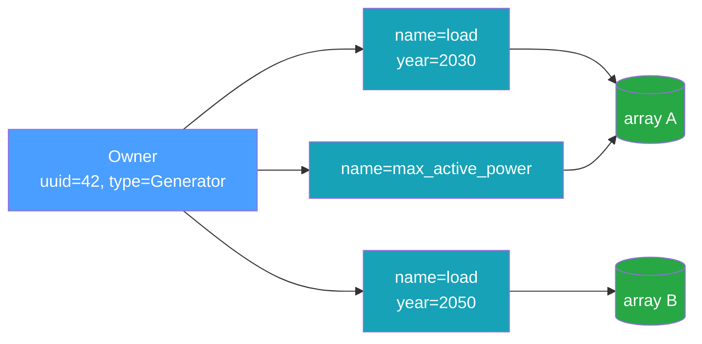

# Data Model

The data model mirrors the time-series concepts in
[InfrastructureSystems.jl](https://github.com/NLR-Sienna/InfrastructureSystems.jl): a **component**
(or supplemental attribute) owns one or more named time series, and each time series may exist in
several variants distinguished by **features**.

## Owners

Every time series belongs to an owner, identified by three fields:

| Field            | Type            | Meaning                                                                              |
| ---------------- | --------------- | ------------------------------------------------------------------------------------ |
| `owner_uuid`     | string          | Stable identity of the owning object (an InfrastructureSystems.jl UUID, for example) |
| `owner_type`     | string          | The owner's concrete type, e.g. `"Generator"`                                        |
| `owner_category` | `OwnerCategory` | `Component` or `SupplementalAttribute`                                               |

`owner_uuid` is a free-form string, so it interoperates with InfrastructureSystems.jl UUIDs, integer
IDs rendered as text, or any other stable identifier scheme. Only `owner_uuid` participates in the
association's uniqueness constraint; `owner_type` and `owner_category` are descriptive.

## Time-Series Types

The data model defines six time-series types, all present in the `TimeSeriesType` enum and the
metadata schema. Both static series types are implemented across every interface. The four forecast
types support reading values across the Rust core, the C ABI, Python, Julia, and gRPC. Dense
forecasts are written through the generic `add_time_series` across the Rust core, Python, and Julia
(the C ABI keeps the per-type `ts_store_add_forecast` / `ts_store_add_probabilistic` transport
functions), and `DeterministicSingleTimeSeries` is derived from stored `SingleTimeSeries` via
`transform_single_time_series` (gRPC stays read-only):

| Type                            | Where implemented | Description                                         |
| ------------------------------- | ----------------- | --------------------------------------------------- |
| `SingleTimeSeries`              | All interfaces    | One array sampled at a fixed resolution             |
| `NonSequentialTimeSeries`       | All interfaces    | Values at explicit, irregular timestamps            |
| `Deterministic`                 | All interfaces    | Forecast: a `(horizon × count)` window matrix       |
| `DeterministicSingleTimeSeries` | All interfaces    | Forecast view over an underlying `SingleTimeSeries` |
| `Probabilistic`                 | All interfaces    | Forecast with percentile bands                      |
| `Scenarios`                     | All interfaces    | Forecast with discrete scenarios                    |

Reading forecast _values_ is wired across the Rust core, the C ABI, Python, Julia, and gRPC. Writing
dense forecasts goes through the generic `add_time_series` (a `Deterministic`, `Probabilistic`, or
`Scenarios` object) in the Rust core, Python, and Julia, with the C ABI exposing the per-type
`ts_store_add_forecast` / `ts_store_add_probabilistic` transport; a `DeterministicSingleTimeSeries`
is produced by `transform_single_time_series`. The read-only gRPC server serves forecast reads but
does not accept writes. See [Forecasts](#forecasts) below.

### `NonSequentialTimeSeries`

A `NonSequentialTimeSeries` pairs each value with an explicit UTC timestamp. Timestamps must be
strictly increasing and their count must match the data length. Its values are stored as a
standalone NetCDF array; timestamps are stored with the association metadata.

### `SingleTimeSeries`

A `SingleTimeSeries` is an `initial_timestamp`, a `resolution` (a fixed step), and an array of
values:

```text
value
  ^
  |        *
  |     *     *
  |  *           *
  +--+--+--+--+--+--> time
   t0 t0+r  ...   t0+(n-1)r
```

The timestamps are implied — sample `i` is at `initial_timestamp + i * resolution` — so only the
values are stored.

### Typed, N-dimensional arrays

Every series' values are a **`TypedArray`**: an element `dtype` (`f64`, `f32`, `i64`, `i32`, `u64`,
or `bool`) and a shape `[length, k1, k2, …]`. The first axis is time; the trailing axes are a fixed
**per-step element shape**, so a step can hold a scalar (empty element shape) or a small tuple — for
example the 3 coefficients of a quadratic cost curve (element shape `[3]`). The optional
`logical_type` label travels with the metadata so a binding can reconstruct its domain object on
read; the store itself never interprets it.

### Forecasts

The four forecast types store their values as a content-addressed `TypedArray` in its **native
shape** (the dense types as standalone NetCDF variables; a `DeterministicSingleTimeSeries` reuses
its backing `SingleTimeSeries` array), while the windowing parameters live in metadata. A forecast
association records `horizon` (the span each window covers), `interval` (the spacing between
successive window start times), `count` (the number of windows), and — for `Probabilistic` — a
`percentiles` vector.

| Type                            | Conventional array shape                   | Extra metadata |
| ------------------------------- | ------------------------------------------ | -------------- |
| `Deterministic`                 | `(horizon_count, count)`                   | —              |
| `DeterministicSingleTimeSeries` | the backing `SingleTimeSeries` array       | —              |
| `Probabilistic`                 | `(percentile_count, horizon_count, count)` | `percentiles`  |
| `Scenarios`                     | `(scenario_count, horizon_count, count)`   | —              |

The store does not interpret the layout — the caller owns the array shape (the Rust core takes a
native-shape `TypedArray` inside a `Deterministic` / `Probabilistic` / `Scenarios` object; the C ABI
takes a row-major byte buffer with explicit dims, and the Julia wrapper accepts a native array and
serializes it row-major), and a `DeterministicSingleTimeSeries` deduplicates against the static
series it forecasts. A `DeterministicSingleTimeSeries` is not added directly — it is derived from
every stored `SingleTimeSeries` by `transform_single_time_series` (Rust core, C ABI, Python, Julia),
sharing the underlying array. Forecast values read back through the high-level path —
`get_time_series` returns a forecast object in the Rust core, Python, and over gRPC, and Julia
exposes `get_time_series(Deterministic, …)` / `get_time_series(Probabilistic, …)` /
`get_time_series(Scenarios, …)` — while the low-level metadata + array path remains available for
raw access. See the [Rust API](../reference/rust-api.md#forecasts) and
[C ABI](../reference/c-abi.md#forecasts).

## Features

Two series can share an owner and a name yet differ — for example a load profile for model year 2030
versus 2050. **Features** disambiguate them. A feature map is a set of typed key/value pairs:

```python
features = {"model_year": 2030, "scenario": "high", "calibrated": True}
```

Feature values are one of four kinds: `int`, `float`, `bool`, or `str`. Internally the map is sorted
by key (a `BTreeMap`), which gives a stable order for hashing and for the uniqueness constraint.

## Keys

A **`TimeSeriesKey`** is the logical handle that re-finds a series. It is exactly the tuple that
must be unique:

```text
TimeSeriesKey = (owner_uuid, time_series_type, name, resolution, features)
```

`add_time_series` returns a key; `get_time_series`, `has_time_series`, and `remove_time_series` take
one. Two series with the same key cannot coexist — attempting to add a duplicate raises
`DuplicateTimeSeries`. Change any element of the tuple (a different `name`, a different `model_year`
feature, a different `resolution`) and you have a distinct series.



Note that two different keys (`K1` and `K3` above) can point at the _same_ underlying array. The key
is a metadata concept; the array is shared by [content addressing](./content-addressing.md).

## Optional Descriptors

Each association can also carry:

- **`units`** — a free-form label such as `"MW"`. No dimensional analysis is performed.
- **`logical_type`** — an opaque, binding-owned label (e.g. `"QuadraticFunctionData"`) for
  reconstructing a domain object on read. The store never interprets it.

These are recorded in metadata and returned on read, but they do not affect identity or storage.
