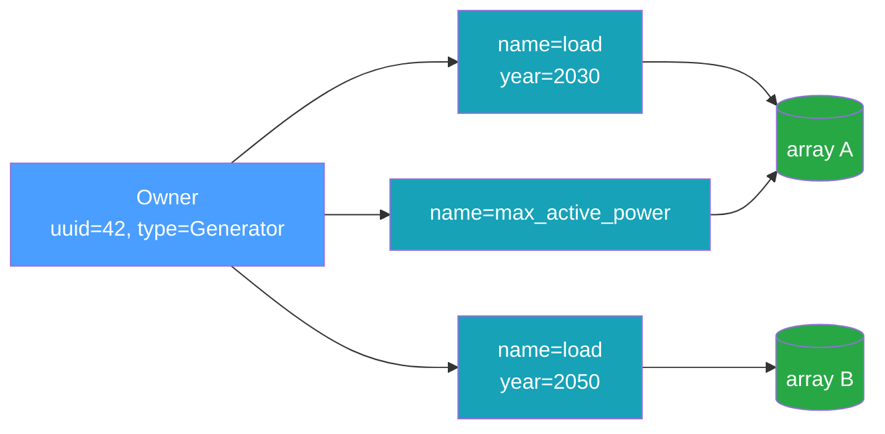

# Data Model

The data model mirrors the time-series concepts in
[InfrastructureSystems.jl](https://github.com/NREL-Sienna/InfrastructureSystems.jl) (IS.jl): a
**component** (or supplemental attribute) owns one or more named time series, and each time series
may exist in several variants distinguished by **features**.

## Owners

Every time series belongs to an owner, identified by three fields:

| Field            | Type            | Meaning                                                           |
| ---------------- | --------------- | ----------------------------------------------------------------- |
| `owner_uuid`     | string          | Stable identity of the owning object (an IS.jl UUID, for example) |
| `owner_type`     | string          | The owner's concrete type, e.g. `"Generator"`                     |
| `owner_category` | `OwnerCategory` | `Component` or `SupplementalAttribute`                            |

`owner_uuid` is a free-form string, so it interoperates with IS.jl UUIDs, integer IDs rendered as
text, or any other stable identifier scheme. Only `owner_uuid` participates in the association's
uniqueness constraint; `owner_type` and `owner_category` are descriptive.

## Time-Series Types

The spec defines six time-series types. They are all present in the `TimeSeriesType` enum and the
metadata schema, but **only `SingleTimeSeries` is implemented end to end in v0**:

| Type                            | v0 status | Description                                           |
| ------------------------------- | --------- | ----------------------------------------------------- |
| `SingleTimeSeries`              | **Full**  | One array sampled at a fixed resolution               |
| `NonSequentialTimeSeries`       | Reserved  | Values at explicit, irregular timestamps              |
| `Deterministic`                 | Reserved  | A forecast: one window per forecast issue time        |
| `DeterministicSingleTimeSeries` | Reserved  | A forecast view over an underlying `SingleTimeSeries` |
| `Probabilistic`                 | Reserved  | Forecast with probability bands                       |
| `Scenarios`                     | Reserved  | Forecast with discrete scenarios                      |

Reserving the slots now means the metadata schema, the hashing domain, and the public APIs already
accept these types, so adding them later does not change the on-disk format. See
[`add_forecast`](../reference/rust-api.md#forecasts-reserved) for the forecast-parameter plumbing
that is already in place.

### `SingleTimeSeries`

A `SingleTimeSeries` is an `initial_timestamp`, a `resolution` (a fixed step), and an array of
values:

```text
value
  ^
  |        *
  |     *     *
  |  *           *
  +--+--+--+--+--+--> time
   t0 t0+r  ...   t0+(n-1)r
```

The timestamps are implied — sample `i` is at `initial_timestamp + i * resolution` — so only the
values are stored. v0 stores **1-D values only** (one scalar per timestep). The in-memory type
(`ArrayD<f64>`) can carry trailing axes for per-step vectors such as cost-curve coefficients, but
the NetCDF backend rejects anything other than rank-1 with an `InvalidParameter` error. That
dimension is reserved for a later milestone.

## Features

Two series can share an owner and a name yet differ — for example a load profile for model year 2030
versus 2050. **Features** disambiguate them. A feature map is a set of typed key/value pairs:

```python
features = {"model_year": 2030, "scenario": "high", "calibrated": True}
```

Feature values are one of four kinds: `int`, `float`, `bool`, or `str`. Internally the map is sorted
by key (a `BTreeMap`), which gives a stable order for hashing and for the uniqueness constraint.

## Keys

A **`TimeSeriesKey`** is the logical handle that re-finds a series. It is exactly the tuple that
must be unique:

```text
TimeSeriesKey = (owner_uuid, time_series_type, name, resolution, features)
```

`add_time_series` returns a key; `get_time_series`, `has_time_series`, and `remove_time_series` take
one. Two series with the same key cannot coexist — attempting to add a duplicate raises
`DuplicateTimeSeries`. Change any element of the tuple (a different `name`, a different `model_year`
feature, a different `resolution`) and you have a distinct series.



Note that two different keys (`K1` and `K3` above) can point at the _same_ underlying array. The key
is a metadata concept; the array is shared by [content addressing](./content-addressing.md).

## Optional Descriptors

Each association can also carry:

- **`units`** — a free-form label such as `"MW"`. No dimensional analysis is performed.
- **`scaling_factor_multiplier`** — an opaque expression string such as `"x * 1.05"`. v0 stores it
  verbatim and never evaluates it.

These are recorded in metadata and returned on read, but they do not affect identity or storage.
