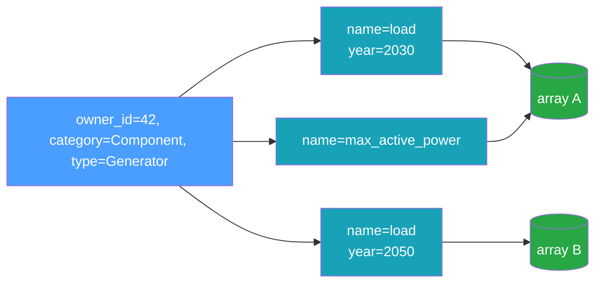

# Data Model

The data model mirrors the time-series concepts originally developed in
[InfrastructureSystems.jl](https://github.com/Sienna-Platform/InfrastructureSystems.jl): a
**component** (or supplemental attribute) owns one or more named time series, and each time series
may exist in several variants distinguished by **features**.

## Owners

Every time series belongs to an owner, identified by three fields:

| Field            | Type            | Meaning                                                       |
| ---------------- | --------------- | ------------------------------------------------------------- |
| `owner_id`       | `i64`           | Stable identity of the owning object (a component identifier) |
| `owner_type`     | string          | The owner's concrete type, e.g. `"Generator"`                 |
| `owner_category` | `OwnerCategory` | `Component` or `SupplementalAttribute`                        |

`owner_id` is a signed 64-bit integer identifier. The **owner identity is the pair
`(owner_id, owner_category)`**: both participate in the association's uniqueness constraint, while
`owner_type` is descriptive. Component and supplemental-attribute integer-id streams are
independent, so the same `owner_id` can name a component **and** a supplemental attribute at once —
the category disambiguates them, keeping the two owners' series distinct. Owner-scoped operations
therefore take the category alongside the id (see [Keys](#keys)).

## Time-Series Types

The data model defines six time-series types, all present in the `TimeSeriesType` enum and the
metadata schema. Both static series types are implemented across every interface. The four forecast
types support reading values across the Rust core, the C ABI, Python, Julia, and gRPC. Dense
forecasts are written through the generic `add_time_series` across the Rust core, Python, and Julia
(the C ABI keeps the per-type `infrastore_store_add_forecast` / `infrastore_store_add_probabilistic`
transport functions), and `DeterministicSingleTimeSeries` is derived from stored `SingleTimeSeries`
via `transform_single_time_series` (gRPC stays read-only):

| Type                            | Write path                                | Description                                         |
| ------------------------------- | ----------------------------------------- | --------------------------------------------------- |
| `SingleTimeSeries`              | `add_time_series`                         | One array sampled at a fixed resolution             |
| `NonSequentialTimeSeries`       | `add_time_series`                         | Values at explicit, irregular timestamps            |
| `Deterministic`                 | `add_time_series`                         | Forecast: a `(horizon × count)` window matrix       |
| `DeterministicSingleTimeSeries` | derived by `transform_single_time_series` | Forecast view over an underlying `SingleTimeSeries` |
| `Probabilistic`                 | `add_time_series`                         | Forecast with percentile bands                      |
| `Scenarios`                     | `add_time_series`                         | Forecast with discrete scenarios                    |

All six types can be **read** from every interface: the Rust core, the C ABI, Python, Julia, the
`infrastore` CLI, and the gRPC server. The **write** paths in the table are available in the Rust
core, the C ABI, Python, Julia, and the CLI — never over gRPC, whose service is read-only. And no
interface adds a `DeterministicSingleTimeSeries` directly: it only ever comes into existence by
transforming a stored `SingleTimeSeries`.

**`DeterministicSingleTimeSeries` is a storage-level view, and reads always return a
`Deterministic`.** This is by design in every binding: `TimeSeriesData` has no
`DeterministicSingleTimeSeries` variant, and a read synthesizes the windowed `Deterministic` from
the underlying static array without copying it. The `DeterministicSingleTimeSeries` tag stays
visible in _catalog_ surfaces — keys, metadata rows, counts, summaries — so callers can see which of
their forecasts are synthetic, and can address, copy, or remove the association.

It is never something you must _ask for_. **A request for `Deterministic` matches both storage
forms** — in reads, key resolution, catalog filters, and reader builds alike — so which one a store
holds stays an internal detail. Requesting `DeterministicSingleTimeSeries` narrows to the derived
form, which is how a caller audits what it has. This mirrors InfrastructureSystems.jl, where a
`Deterministic` request lowers to both concrete type names.

Reading forecast _values_ is wired across the Rust core, the C ABI, Python, Julia, and gRPC. Writing
dense forecasts goes through the generic `add_time_series` (a `Deterministic`, `Probabilistic`, or
`Scenarios` object) in the Rust core, Python, and Julia, with the C ABI exposing the per-type
`infrastore_store_add_forecast` / `infrastore_store_add_probabilistic` transport; a
`DeterministicSingleTimeSeries` is produced by `transform_single_time_series`. The read-only gRPC
server serves forecast reads but does not accept writes. See [Forecasts](#forecasts) below.

### `NonSequentialTimeSeries`

A `NonSequentialTimeSeries` pairs each value with an explicit UTC timestamp. Timestamps must be
strictly increasing and their count must match the data length.

The timestamp vector is stored in the catalog, **content-addressed and shared**: series sampled at
the same instants — an outage schedule, a set of event times, a market timeline — hold one copy
between them rather than one each. That shared vector is also the series' _cohort_: the values of
every series on it are column-packed into one timestamp-major HDF5 dataset, exactly as
`SingleTimeSeries` at one resolution are, so a [`StaticReader`](../reference/rust-api.md#readers)
can sweep them a timestamp at a time. A series alone on its time axis keeps a standalone array
instead — packing only pays once a cohort is several columns wide. See the
[storage model](./storage-model.md) for the layout.

### `SingleTimeSeries`

A `SingleTimeSeries` is an `initial_timestamp`, a `resolution` (a [period](#periods)), and an array
of values:

```text
value
  ^
  |        *
  |     *     *
  |  *           *
  +--+--+--+--+--+--> time
   t0 t0+r  ...   t0+(n-1)r
```

The timestamps are implied — sample `i` is at `initial_timestamp + i * resolution` — so only the
values are stored.

### Periods

`resolution`, and the forecast `horizon`/`interval`, are **calendar-aware periods**, not plain fixed
spans. A period is one of two kinds:

- **fixed** — a fixed nanosecond span (`Hour`, `Minute`, `Day`, `Week`), backed by a duration;
- **calendar** — a count of calendar months (`Month` = 1, `Quarter` = 3, `Year` = 12), where
  `initial_timestamp + i * resolution` is computed by calendar arithmetic (so a monthly grid lands
  on the same day-of-month each step rather than every `N` milliseconds).

A fixed period is **never** equal to a calendar one, even when their spans coincide for a given
month. Periods are encoded as ISO-8601 duration strings (`PT1H`, `P1M`, `P1Y`) on disk and across
every binding (the Python/gRPC surfaces accept a `timedelta`/duration for fixed periods and an
ISO-8601 string for either kind, and return the ISO-8601 string).

### Timestamp precision

Every instant the store records — a `SingleTimeSeries` or forecast `initial_timestamp`, and every
entry of a `NonSequentialTimeSeries` timestamp vector — is **a whole number of milliseconds**, the
same floor a fixed period has. One millisecond is the finest resolution a period can express, and it
is likewise the finest instant a series can be written at.

The rule is enforced on write, in the core, for all five addable types: a finer instant is rejected
with an `InvalidParameter` error rather than truncated. This is what makes a timestamp mean the same
thing in every consumer. The bindings do not share one precision — the C ABI and Julia exchange
instants as `i64` Unix milliseconds, Python's `datetime` is microsecond, and gRPC and the Rust core
carry a full RFC 3339 string — so a finer instant would be silently truncated at some boundaries and
not others, putting the same series on different instants depending on who read it. For a
`NonSequentialTimeSeries` whose timestamps are less than a millisecond apart it is worse: two
distinct timestamps collapse into one, and the vector stops being strictly increasing on the way
back out.

A series needing a finer grid should scale its unit and record it in `units`, exactly as it must for
a sub-millisecond resolution: a 500 µs series is a 500-unit series.

Two things are deliberately _not_ constrained. A **query bound** — a `time_range` end, a reader's
`when` — may be arbitrarily fine; it is not stored, and the read paths already say what an off-grid
bound does (see [reading a time range](../reference/rust-api.md#reading-a-time-range)). And **reads
stay permissive**: an artifact written before this rule may hold finer instants and still reads back
exactly as written, which is why the rule does not change `DATA_FORMAT_VERSION`.

### Typed, N-dimensional arrays

Every series' values are a **`TypedArray`**: an element `dtype` (`f64`, `f32`, the integer widths,
or `bool`) and a shape `[length, k1, k2, …]`. The first axis is time; the trailing axes are a fixed
**per-step element shape**, so a step can hold a scalar (empty element shape) or a small tuple — for
example the 3 coefficients of a quadratic cost curve (element shape `[3]`). The association's
`element_type` says what those elements mean and how a ragged value (a piecewise curve, say) is
packed into a fixed-width row — see [Element types](../reference/element-types.md). The optional
`application_data` payload travels alongside for a binding's own use; the store never interprets it.

### Forecasts

The four forecast types store their values as a content-addressed `TypedArray` in its **native
shape** (the dense types as standalone HDF5 variables; a `DeterministicSingleTimeSeries` reuses its
backing `SingleTimeSeries` array), while the windowing parameters live in metadata. A forecast
association records `horizon` (the span each window covers), `interval` (the spacing between
successive window start times), `count` (the number of windows), and — for `Probabilistic` — a
`percentiles` vector.

| Type                            | Conventional array shape                   | Extra metadata |
| ------------------------------- | ------------------------------------------ | -------------- |
| `Deterministic`                 | `(horizon_count, count)`                   | —              |
| `DeterministicSingleTimeSeries` | the backing `SingleTimeSeries` array       | —              |
| `Probabilistic`                 | `(percentile_count, horizon_count, count)` | `percentiles`  |
| `Scenarios`                     | `(scenario_count, horizon_count, count)`   | —              |

The store does not interpret the layout — the caller owns the array shape (the Rust core takes a
native-shape `TypedArray` inside a `Deterministic` / `Probabilistic` / `Scenarios` object; the C ABI
takes a row-major byte buffer with explicit dims, and the Julia wrapper accepts a native array and
serializes it row-major), and a `DeterministicSingleTimeSeries` deduplicates against the static
series it forecasts. A `DeterministicSingleTimeSeries` is not added directly — it is derived from
every stored `SingleTimeSeries` by `transform_single_time_series` (Rust core, C ABI, Python, Julia),
sharing the underlying array. Because a `DeterministicSingleTimeSeries` is a synthetic view of a
`SingleTimeSeries`, it is **mutually exclusive** with a real `Deterministic` for the same family
(`owner`, `name`, `resolution`, `features`, regardless of interval): adding a `Deterministic` when a
`DeterministicSingleTimeSeries` view exists — or deriving one when a `Deterministic` exists — raises
`InvalidParameter`. Forecast values read back through the high-level path — `get_time_series`
returns a forecast object in the Rust core, Python, and over gRPC, and Julia exposes
`get_time_series(Deterministic, …)` / `get_time_series(Probabilistic, …)` /
`get_time_series(Scenarios, …)` — while the low-level metadata + array path remains available for
raw access. See the [Rust API](../reference/rust-api.md#forecasts) and
[C ABI](../reference/c-abi.md#forecasts).

## Features

Two series can share an owner and a name yet differ — for example a load profile for model year 2030
versus 2050. **Features** disambiguate them. A feature map is a set of typed key/value pairs:

```python
features = {"model_year": 2030, "scenario": "high", "calibrated": True}
```

Feature values are one of four kinds: `int`, `float`, `bool`, or `str`. Internally the map is sorted
by key (a `BTreeMap`), which gives a stable order for hashing and for the uniqueness constraint.

### Reserved feature names

A feature name may not collide with a field of a time series or of the [key](#keys) that addresses
one. Consumers routinely spread a feature map into a keyword-argument query — for example
`get_time_series(...; name = "load", model_year = 2030)` — and a feature called `name` or
`resolution` would shadow the real field there and silently change what the query means. Adding a
time series with one of these names raises `InvalidParameter`:

```text
application_data, component_field, count, data, data_hash, dtype, element_shape, element_type, ext,
features, horizon, id, initial_timestamp, interval, length, name, owner_category, owner_id,
owner_type, percentiles, quantity_kind, resolution, scenario_count, time_reference,
time_series_type, timestamps, unit_system, units
```

`dtype` and `ext` no longer name metadata fields — `element_type` and `application_data` replaced
them — but both stay reserved. `dtype` is still how every binding spells a `TypedArray`'s physical
type, and a consumer still passing the retired `ext=` should fail loudly rather than have it
silently accepted as an ordinary feature.

The match is exact and case-sensitive, like every other identifier in the catalog: `resolution` is
rejected, while `Resolution` and `resolution_hours` are ordinary feature names. The rule applies to
writes only, so a store written before it existed stays readable and its series can still be listed
and removed.

## Keys

A **`TimeSeriesKey`** is the logical handle that re-finds a series. It is exactly the tuple that
must be unique:

```text
TimeSeriesKey = (owner_id, owner_category, time_series_type, name, resolution, interval, features)
```

`add_time_series` returns a key; `get_time_series`, `has_time_series`, and `remove_time_series` take
one. Two series with the same key cannot coexist — attempting to add a duplicate raises
`DuplicateTimeSeries`. Change any element of the tuple (a different `name`, a different `model_year`
feature, a different `resolution`, a different forecast `interval`, or a different `owner_category`)
and you have a distinct series. `interval` is `NULL` for the static types (which never carry one);
for forecasts it lets two series of one variable at the same resolution but different intervals
(e.g. a day-ahead and a real-time forecast) coexist as distinct series. Because `owner_category` is
part of the key, a component and a supplemental attribute that share a numeric `owner_id` keep
entirely separate sets of series.



Note that two different keys (`K1` and `K3` above) can point at the _same_ underlying array. The key
is a metadata concept; the array is shared by [content addressing](./content-addressing.md).

## Association IDs

Every catalog row also has an **`id`**: a plain integer, assigned by the store, that names _that
row_. It is the second way to re-find a series, and it answers a question a key cannot.

A key describes a series — owner, name, resolution, features. An id names the row the store filed it
under. That difference is the point: a consumer that wants to record "this generator's cost curve is
_that_ series" inside its own object model would otherwise have to embed the whole key tuple, and
keep it in step with every rename. An id is one integer, and a rename does not move it.

```julia
added = add_time_series!(store, 42, "ThermalStandard", Component, cost_curve)
generator.operation_cost.variable = added.id   # one integer, stored in the model
```

Three properties make an id safe to persist:

- **It is never reissued.** Deleting a row strands its id permanently. A reference to a deleted
  series stops resolving — it can never come back meaning a _different_ series, which is the failure
  a recycled row number would cause silently, with no foreign key anywhere to catch it.
- **It survives the operations that change a series' description.** A rename or a reassignment to a
  new owner keeps the id, as do `compact` and a save-and-reopen. Those are `UPDATE`s and file
  copies, not new rows.
- **It is not part of identity.** Two series differing only in id are the same series to the
  uniqueness rule and to both content hashes. It sits outside the key deliberately: a key is also an
  _argument_ — to `get_time_series`, to `remove_time_series!` — where an id would mean nothing.

**The store assigns it; no add accepts one.** Not `add_time_series`, not a bulk add, and not either
association catalog's `attach` / `link`. This is what makes "never reissued" a guarantee rather than
a convention: `AUTOINCREMENT` only ratchets its counter upward, so an assigned id is never handed
out twice, while a caller free to name one could re-file a retired id and make a stale reference in
some consumer's model quietly resolve to a different series. The association row types carry an `id`
field because a listing populates one, but it is an output — an add ignores it, so a row read from
one store and attached to another is filed under a fresh id there.

What an id does _not_ do is travel between stores. It is the row's number in one catalog, so a
`merge` assigns fresh ids in the destination, and two stores holding identical content will disagree
about them. The one place ids do cross a boundary — and the one writer that files rows under ids it
was given — is the [OpenAPI document round trip](../reference/file-format.md), where preserving them
is the whole point: an import that assigned fresh ids would leave every reference the document
carries pointing at the wrong series. That wire form spells the field `association_id` — in a
document travelling beside components and supplemental attributes, an unqualified `id` would not say
which id it is — and the schema requires it on every time-series row. Because the import is the only
door, the guarantee holds there too: a supplied id must sit above the destination catalog's counter
(`DuplicateAssociationId` otherwise, so a document's ids fit a fresh store but not one that has
issued ids of its own), and a document supplies one for every row or for none. Neither association
catalog's wire form carries an id at all, so both always assign.

The same round trip carries two fields the schema gained late, vendored here from an un-merged
SiennaSchemas branch (`conformance/sienna_schemas/SOURCE.md` records which commit): `array_shape`,
the stored array's full native shape (`[length, *element_shape]` in the catalog's terms, where the
schema's `element_shape` is only the per-step trailing shape), and `time_reference`. Both exist so
an imported row is _identical_ to the exported one — the forecast layouts above are conventions the
caller owns, so the native shape cannot be rebuilt from `horizon` and `count`. Neither is required:
a producer predating them writes rows without them, a reader that does not know them ignores them,
and an import that finds them absent falls back to the schema's own fields.

Each of the three catalog tables keeps its own independent counter, so an id is only meaningful
alongside the table it came from.

Writes report the id they used, and reads take one:

| Direction | Rust                                  | Python               | Julia                |
| --------- | ------------------------------------- | -------------------- | -------------------- |
| Write     | `add_time_series` → `AddedTimeSeries` | `.id` on the result  | `.id` on the result  |
| Resolve   | `get_metadata_by_id`                  | `get_metadata_by_id` | `get_metadata_by_id` |
| Validate  | `association_exists`                  | `association_exists` | `association_exists` |
| Read      | `read_by_ids`                         | `read_by_ids`        | `read_by_ids`        |

`association_exists` fetches no row, so a consumer can check every reference in its model on load
rather than discovering a dangling one mid-simulation.

## Optional Descriptors

Each association can also carry:

- **`units`** — a free-form, end-user-facing label such as `"MW"`. No dimensional analysis is
  performed.
- **`quantity_kind`** — what kind of physical quantity the values measure, e.g. `"ActivePower"`,
  `"Energy"`, `"Length"`. Free-form; the recommended vocabulary is a
  [QUDT](https://www.qudt.org/pages/QUDToverviewPage.html) `QuantityKind` local name. It sits
  _above_ `units` rather than duplicating it, for two reasons. A units library's dimensional
  analysis cannot separate active from reactive power — both are `[M L^2 T^-3]` — but a quantity
  kind can. And when `unit_system` is `component_base` the values are per-unit and therefore
  dimensionless, so this is the only surviving record of what they measure and which base converts
  them back. The column is deliberately unconstrained: the composite economic quantities an energy
  modeler needs (`$/MWh`, `MMBtu/MWh`) are exactly where QUDT's coverage thins out.
- **`unit_system`** — which basis the values are expressed in: `natural_units` (the units named by
  `units`) or `component_base` (per-unit against the owning component's own base). This is the
  per-unit declaration power-systems modelers know as the _unit system_; PowerSystems.jl spells the
  same idea `UnitSystem`, with `NATURAL_UNITS` and `DEVICE_BASE`. It is a **label, not a
  conversion**: the store holds no base value and rescales nothing, so converting `component_base`
  values back to natural units is the consumer's job, using the base that lives on the owning
  component in its own object graph. Unset means _unspecified_, which is deliberately **not** the
  same as `natural_units` — every association written before this field existed is unset, and
  reading those as natural units would assert a basis nobody declared.
- **`component_field`** — the field on the owning component whose value these values are the
  time-varying form of, e.g. `"max_active_power"` or `"rating"`. Free-form and never interpreted: it
  names a field in the consumer's own object model, which the store has no view of. It records what
  the values are _for_, where `name` only says which series they are — the two coincide by
  convention in many models but are not the same thing, since one component may carry several series
  for one field (a forecast and an actual, a set of weather years) and `name` is part of a series'
  identity where this is not. Named for the common case; when the owner is a supplemental attribute
  it names a field on that attribute.
- **`time_reference`** — how this series' timestamps were _spelled_: `utc`, `zoneless`, a fixed
  offset (`-07:00`), or an IANA zone name (`America/Denver`). See
  [Time references](#time-references) below, which this one deserves a section of its own for.
- **`application_data`** — an opaque, **package-owned** extension payload stored verbatim (typically
  JSON) that a binding writes and reads for its own purposes. The store never parses or interprets
  it, and end users are not expected to set it. Element typing does _not_ live here: that is
  `element_type` below, a first-class column the store owns and validates.
- **`element_type`** — what the array's elements _mean_, in the store's own language-neutral
  vocabulary: a dtype spelling (`f64`, `i64`, …) for plain numbers, else `tuple(N,dtype)` or one of
  the function-data kinds (`linear_function`, `quadratic_function`, `piecewise_linear`,
  `piecewise_step`). It supersedes a separate physical `dtype`: the dtype of the stored bytes is
  derived from it. Unlike `units` and `application_data` it is _not_ inert — the write path
  validates the array's dtype and per-step shape against it. See
  [Element types](../reference/element-types.md).

`units`, `quantity_kind`, `unit_system`, `time_reference`, `component_field`, and `application_data`
are recorded in metadata and returned on read, but they do not affect identity or storage: they are
absent from the key and from both content hashes, so two series differing only in a descriptor are a
duplicate.

`component_field` is the one descriptor that is also a **filter** (`ListFilter::component_field`,
and its equivalent in every binding): "every series that varies this field", alone or scoped to one
owner. Being descriptive rather than identifying, it narrows a listing but never addresses a single
row on its own — one component may carry several series for one field, distinguished by name or
features. It matches exactly and case-sensitively, and a series that declares no `component_field`
matches no value, so the filter cannot select the rows that left it unset.

## Time References

The store records **instants**. A `time_reference` records what those instants were _written as_, so
a series comes back the way it went in instead of being relabelled UTC at every boundary.

| Spelling         | Meaning                                                           |
| ---------------- | ----------------------------------------------------------------- |
| `utc`            | An instant, written as UTC.                                       |
| `-07:00`         | An instant, written at a fixed offset from UTC.                   |
| `America/Denver` | An instant, written in a named IANA zone. Held opaquely.          |
| `zoneless`       | A wall clock. Names no instant; the store holds it as if UTC.     |
| _unset_          | Unspecified — **not** a claim the timestamps were written as UTC. |

Three of the four name an instant; `zoneless` does not, and most rules below split on that binary
rather than on the four spellings. An unset reference groups with the zoned ones.

Each binding **infers** the spelling from the input type, so nothing takes a new required argument:

| Binding | `utc`                    | fixed offset             | named zone                             | `zoneless`                     |
| ------- | ------------------------ | ------------------------ | -------------------------------------- | ------------------------------ |
| Python  | `timezone.utc`           | fixed-offset `tzinfo`    | `tzinfo` exposing a `key` (`ZoneInfo`) | naive `datetime`               |
| Julia   | UTC `ZonedDateTime`      | `FixedTimeZone`          | `VariableTimeZone`, by its name        | bare `DateTime`                |
| CLI     | `Z` in text, or the flag | `-07:00` in text or flag | `--assume-timezone America/Denver`     | bare timestamp, `--zoneless`   |
| Rust    | `DateTime<Utc>`          | declare it               | declare it                             | **declare it** — no naive type |

`ZoneInfo("UTC")` records the _zone_ `UTC`, not the literal `utc`. The two render identically
forever; the difference shows up only in what the catalog reports back, which is the point of
recording a spelling at all.

### A spelling is not a grid

A reference records how timestamps were _written_. It does not change how the grid is _stepped_:
`resolution` and `interval` are durations, so an hourly series has hourly **instants** whatever its
reference says. Rendering an hourly `America/Denver` series across the November fall-back gives
`01:00-06:00`, `01:00-07:00`, `02:00-07:00` — two identical wall clocks, two distinct instants,
correctly ordered.

That is the difference between two things "store this in Denver time" can mean:

- **Instants, displayed in Denver.** Storage is untouched — UTC instants plus a label. **This is
  what a named zone means here.**
- **A local-clock grid** — hourly _by the clock_, so a 23-hour day in March and a 25-hour one in
  November. This is inexpressible in `SingleTimeSeries` and the dense forecasts, whose grid is a
  `Period`: a fixed count of milliseconds. Use `NonSequentialTimeSeries`, which carries an explicit
  instant per value, so the caller derives those days and the data records them rather than
  arithmetic implying them.

Someone with 8760 naive Denver timestamps who localizes only the first and passes `resolution = 1h`
gets labels shifted by an hour after each transition, and nothing in the data distinguishes that
from a correct series. The store cannot detect it; the split above is the thing to know.

### Months step on the UTC calendar

`Period::Months` is calendar arithmetic, so unlike a fixed period it has to be told _which_
calendar. It uses the stored **UTC** one, and the reference does not redirect it. TimeZones.jl steps
the _local_ clock instead, so the two disagree by an hour at every DST transition and by up to a day
at a month boundary.

Local-frame stepping is refused for two independent reasons: it is the local → instant direction the
store deliberately never runs (below), and it would let a spelling decide _which instants_ a series
contains. A calendar period on a zoned series is warned about on write, so the disagreement is
findable before it is filed as a bug. A caller who wants months on a local calendar wants a
local-clock grid, and the answer is the one above: `NonSequentialTimeSeries`.

### Why a named zone is safe

The ambiguity a named zone is feared for lives in the **local → instant** direction, and the core
never runs it.

- **On input** that direction has already happened, in the caller's own datetime library. Julia
  refuses an ambiguous local time outright; Python resolves it through `fold`. Either way the
  binding is handed a value that already names one definite instant. The CLI is the exception,
  because it is handed _text_ — see below.
- **On output** the store runs only **instant → local**, which is total and single-valued: one
  instant maps to exactly one wall clock in a named zone, and converting it back yields the same
  instant.

So a year-long Denver series stamped `-07:00` renders every timestamp after the March transition an
hour wrong, while the same series stamped `America/Denver` renders all of them correctly. Recording
"the offset in effect at `initial_timestamp`" is the one option that is quietly incorrect, which is
why it is not among the four spellings.

Two caveats belong here rather than in the type. Rendering a named zone is
**tz-database-dependent**, so a retroactive rule change moves the displayed local time of an
already-stored instant — the store records the instant, and the label is a rendering hint. And a
zone name's **existence is audited, never gated**: the core checks only that a name is shaped like
an IANA name and cannot be read as an offset or as either literal. Every layer that _has_ a database
— the CLI via `chrono-tz`, Python via `zoneinfo`, Julia via `TimeZones` — warns on a name it does
not recognize and stores it anyway, and `infrastore store-info` reports the catalog's distinct
spellings with unrecognized zones flagged. Gating would turn a rare read-time error into a
write-time error coupled to _our_ release cadence: when IANA adds a zone, a caller whose own
database already has it would be refused until they upgraded.

### The CLI is where local → instant actually happens

Every other binding is handed an already-resolved datetime. The CLI is handed text, so
`--assume-timezone America/Denver` over a zoneless column is the one place in the system that runs
local → instant itself, and `chrono-tz` answers in three values — each with its own behavior, per
row:

| Result           | Meaning                         | CLI behavior                                  |
| ---------------- | ------------------------------- | --------------------------------------------- |
| a single instant | the ordinary case               | ingest it                                     |
| two candidates   | the repeated fall-back hour     | **error**, naming the row and both candidates |
| none             | the skipped spring-forward hour | **error**, naming the row                     |

Rejecting loudly, per row, with both candidates named is what makes a named zone acceptable here;
silently picking one is not. Reading is unaffected: rendering a stored instant in a named zone is
the total direction, so `--assume-timezone` plays no part in it.

### Query bounds and mixed selections

A bound must be spelled the way the series is, and a mismatch is refused rather than coerced:

| Series reference      | Wall-clock bound | Instant bound                              |
| --------------------- | ---------------- | ------------------------------------------ |
| `utc` / offset / zone | **error**        | accept — any offset names the same instant |
| `zoneless`            | accept           | **error**                                  |
| _unset_               | **error**        | accept                                     |

An off-grid bound still names an unambiguous instant, so flooring it is well-defined — that is why
`time_range` snaps. A wall-clock bound against a series that records instants is a **category
error**: there is no defined mapping to fall back on. Bounds stay unconstrained in _precision_,
though: a sub-millisecond bound names a real instant even though a stored one may not.

The same partition drives two rejections and one filter:

1. A **ranged bulk read** over a selection spanning both groups is refused — no single bound is
   valid for all of it. An unranged one is unaffected: without a bound there is nothing to disagree
   about, and each series carries its own spelling back.
2. A **`StaticReader`** materializes one timestamp axis, so a mixed cohort is refused at _build_
   time, where the error can name the series that disagree. Mixing `utc`, an offset, and a named
   zone in one cohort is fine — all three name instants, and the axis is spelled with the cohort's
   reference when every member agrees and `utc` when they merely agree on naming instants.
3. **`ListFilter::zoneless`** is the constructive half: `true` selects the wall-clock series,
   `false` selects everything that accepts an instant bound — the three zoned spellings _and_ the
   rows that left the reference unset. It is a binary predicate rather than a match on a specific
   spelling because an exact match cannot name that second group at all (the trap `component_field`
   documents), and here those rows are a coherence group rather than an oversight.

## Associations Between Entities

Beyond owning time series, catalog entities can be related to each other. The catalog records two
such relationships, in two separate tables, because they are not the same kind of thing: attaching
an attribute to a component and wiring one component to another have different identities and
different query patterns.

### Supplemental attributes attached to components

| Field                            | Meaning                                  |
| -------------------------------- | ---------------------------------------- |
| `component_id`, `component_type` | The component carrying the attribute     |
| `attribute_id`, `attribute_type` | The supplemental attribute being carried |

**Identity is the `(component_id, attribute_id)` pair.** The type names are denormalized labels, not
part of identity: re-attaching the same pair under different type names is a duplicate and is
rejected. One attribute may be attached to many components, and one component may carry many
attributes; only the exact pair is constrained.

### Parent/child edges between components

| Field                      | Meaning                                          |
| -------------------------- | ------------------------------------------------ |
| `parent_id`, `parent_type` | The parent component, e.g. a generator           |
| `child_id`, `child_type`   | The child component, e.g. the bus it connects to |

Both endpoints are always components, so unlike time-series owners there is no category to
disambiguate. **Identity is the ordered `(parent_id, child_id)` pair** — the reversed pair is a
different edge. There is no relationship-kind column, so a given pair may be related at most once.

### Properties shared by both

Two consequences of the deliberate absence of foreign keys and cascades:

- **Associations and time series are independent in both directions.** Removing a component's time
  series does not remove its attribute attachments or its edges, and removing either does not touch
  any series. A consumer that wants both effects makes both calls.
- **The store never observes a deletion it did not perform.** Components and attributes live in the
  consumer's object graph, so a cascade could never fire; consumers call the matching `remove_*`
  with the appropriate filter instead.

Filtering takes lists of **concrete** type names, rendered into SQL `IN (…)`. Expanding an abstract
type into its subtypes stays in the calling language, where the type hierarchy lives.

> Terminology: rows of the `time_series_associations` table — the owner-to-time-series records
> described above — are also called "associations" throughout this documentation and the code. They
> are unrelated to the entity-to-entity tables described in this section.

Both are available in the Rust core, the C ABI, Julia, and Python; neither is exposed over gRPC or
the `infrastore` CLI. The supplemental-attribute surface is the wider of the two (it carries counts
and a grouped summary) because each of its operations is driven by an existing consumer; the
parent/child surface is deliberately narrower for now.
