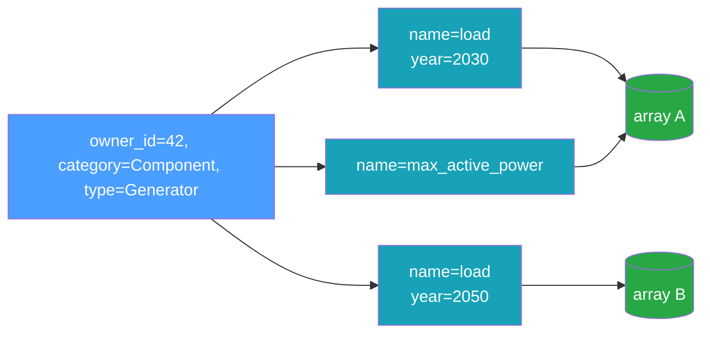

# Data Model

The data model mirrors the time-series concepts originally developed in
[InfrastructureSystems.jl](https://github.com/Sienna-Platform/InfrastructureSystems.jl): a
**component** (or supplemental attribute) owns one or more named time series, and each time series
may exist in several variants distinguished by **features**.

This page covers the **catalog** side of that — who owns a series, what distinguishes two series
that share a name, how a row is filed, and how it is addressed once stored. Two neighbors cover the
rest: [Time-Series Types](./time-series-types.md) for what the six types mean and which to reach
for, and [Time References](./time-references.md) for how a series' timestamps are spelled.

## Owners

Every time series belongs to an owner, identified by three fields:

| Field            | Type            | Meaning                                                       |
| ---------------- | --------------- | ------------------------------------------------------------- |
| `owner_id`       | `i64`           | Stable identity of the owning object (a component identifier) |
| `owner_type`     | string          | The owner's concrete type, e.g. `"Generator"`                 |
| `owner_category` | `OwnerCategory` | `Component` or `SupplementalAttribute`                        |

`owner_id` is a signed 64-bit integer identifier. The **owner identity is the pair
`(owner_id, owner_category)`**: both participate in the association's uniqueness constraint, while
`owner_type` is descriptive. Component and supplemental-attribute integer-id streams are
independent, so the same `owner_id` can name a component **and** a supplemental attribute at once —
the category disambiguates them, keeping the two owners' series distinct. Owner-scoped operations
therefore take the category alongside the id (see [Identity](#identity)).

## Features

Two series can share an owner and a name yet differ — for example a load profile for model year 2030
versus 2050. **Features** disambiguate them. A feature map is a set of typed key/value pairs:

```python
features = {"model_year": 2030, "scenario": "high", "calibrated": True}
```

Feature values are one of four kinds: `int`, `float`, `bool`, or `str`. Internally the map is sorted
by key (a `BTreeMap`), which gives a stable order for hashing and for the uniqueness constraint.

### Reserved feature names

A feature name may not collide with a field of a time series or of the [identity](#identity) a row
is filed under. Consumers routinely spread a feature map into a keyword-argument query — for example
`list_metadata(...; name = "load", model_year = 2030)` — and a feature called `name` or `resolution`
would shadow the real field there and silently change what the query means. Adding a time series
with one of these names raises `InvalidParameter`:

```text
application_data, component_field, count, data, data_hash, dtype, element_shape, element_type, ext,
features, horizon, id, initial_timestamp, interval, length, name, owner_category, owner_id,
owner_type, percentiles, quantity_kind, resolution, scenario_count, time_reference,
time_series_type, timestamps, unit_system, units
```

`dtype` and `ext` no longer name metadata fields — `element_type` and `application_data` replaced
them — but both stay reserved. `dtype` is still how every binding spells a `TypedArray`'s physical
type, and a consumer still passing the retired `ext=` should fail loudly rather than have it
silently accepted as an ordinary feature.

The match is exact and case-sensitive, like every other identifier in the catalog: `resolution` is
rejected, while `Resolution` and `resolution_hours` are ordinary feature names. The rule applies to
writes only, so a store written before it existed stays readable and its series can still be listed
and removed.

## Identity

Every association is filed under a tuple that must be unique:

```text
identity = (owner_id, owner_category, time_series_type, name, resolution, interval, features)
```

This is what the catalog de-duplicates on — it is **not** how a caller addresses a series. That is
the [association id](#association-ids) below. Two series with the same identity cannot coexist —
attempting to add a duplicate raises `DuplicateTimeSeries`. Change any element of the tuple (a
different `name`, a different `model_year` feature, a different `resolution`, a different forecast
`interval`, or a different `owner_category`) and you have a distinct series. `interval` is `NULL`
for the static types (which never carry one); for forecasts it lets two series of one variable at
the same resolution but different intervals (e.g. a day-ahead and a real-time forecast) coexist as
distinct series. Because `owner_category` is part of the key, a component and a supplemental
attribute that share a numeric `owner_id` keep entirely separate sets of series.



Note that two different series (`K1` and `K3` above) can point at the _same_ underlying array. An
identity is a metadata concept; the array is shared by
[content addressing](./content-addressing.md).

## Association IDs

Every catalog row has an **`id`**: a plain integer, assigned by the store, that names _that row_. It
is **the** way to address a series — every read, removal and copy takes one.

The identity above describes a series: owner, name, resolution, features. An id names the row the
store filed it under. That difference is the point: a consumer that wants to record "this
generator's cost curve is _that_ series" inside its own object model would otherwise have to embed
the whole identity tuple, and keep it in step with every change to it. An id is one integer, and
nothing moves it: a name is fixed once written, so the two can never drift apart.

```julia
id = add_time_series!(store, 42, "ThermalStandard", Component, cost_curve)
generator.operation_cost.variable = id   # one integer, stored in the model
```

The surface splits in two along that line. **Identify** — `list_metadata` and its by-id companions —
answers which series exist and hands back the id for each. **Act** — every read, removal and copy —
takes that id. A caller that knows a series only by its attributes does the first half once and
keeps the id; there is deliberately no combined resolver, because the two halves have different
costs and a caller that repeats a lookup it could have cached should be able to see that it is.

Three properties make an id safe to persist:

- **It is never reissued.** Deleting a row strands its id permanently. A reference to a deleted
  series stops resolving — it can never come back meaning a _different_ series, which is the failure
  a recycled row number would cause silently, with no foreign key anywhere to catch it.
- **It survives the operations that change a series' description.** A rename or a reassignment to a
  new owner keeps the id, as do `compact` and a save-and-reopen. Those are `UPDATE`s and file
  copies, not new rows.
- **It is not part of identity.** Two series differing only in id are the same series to the
  uniqueness rule and to both content hashes. It describes the _row_, not the data.

**The store assigns it; no add accepts one.** Not `add_time_series`, not a bulk add, and not either
association catalog's `attach` / `link`. This is what makes "never reissued" a guarantee rather than
a convention: `AUTOINCREMENT` only ratchets its counter upward, so an assigned id is never handed
out twice, while a caller free to name one could re-file a retired id and make a stale reference in
some consumer's model quietly resolve to a different series. The association row types carry an `id`
field because a listing populates one, but it is an output — an add ignores it, so a row read from
one store and attached to another is filed under a fresh id there.

What an id does _not_ do is travel between stores. It is the row's number in one catalog, so a
`merge` assigns fresh ids in the destination, and two stores holding identical content will disagree
about them. The one place ids do cross a boundary — and the one writer that files rows under ids it
was given — is the [OpenAPI document round trip](../reference/file-format.md), where preserving them
is the whole point: an import that assigned fresh ids would leave every reference the document
carries pointing at the wrong series. That wire form spells the field `association_id` — in a
document traveling beside components and supplemental attributes, an unqualified `id` would not say
which id it is — and the schema requires it on every time-series row. Because the import is the only
door, the guarantee holds there too: a supplied id must sit above the destination catalog's counter
(`DuplicateAssociationId` otherwise, so a document's ids fit a fresh store but not one that has
issued ids of its own), and a document supplies one for every row or for none. Neither association
catalog's wire form carries an id at all, so both always assign.

The same round trip carries two fields the schema gained late, vendored here from an un-merged
SiennaSchemas branch (`conformance/sienna_schemas/SOURCE.md` records which commit): `array_shape`,
the stored array's full native shape (`[length, *element_shape]` in the catalog's terms, where the
schema's `element_shape` is only the per-step trailing shape), and `time_reference`. Both exist so
an imported row is _identical_ to the exported one — the forecast layouts above are conventions the
caller owns, so the native shape cannot be rebuilt from `horizon` and `count`. Neither is required:
a producer predating them writes rows without them, a reader that does not know them ignores them,
and an import that finds them absent falls back to the schema's own fields.

Each of the three catalog tables keeps its own independent counter, so an id is only meaningful
alongside the table it came from.

Writes report the id they used, and reads take one:

| Direction  | Rust                               | Python                 | Julia                  |
| ---------- | ---------------------------------- | ---------------------- | ---------------------- |
| Write      | `add_time_series` → `TimeSeriesId` | → `int`                | → `Int64`              |
| Identify   | `list_metadata`                    | `list_metadata`        | `list_metadata`        |
| …by id     | `list_metadata_by_ids`             | `list_metadata_by_ids` | `list_metadata_by_ids` |
| Resolve    | `get_metadata_by_id`               | `get_metadata_by_id`   | `get_metadata_by_id`   |
| Validate   | `association_exists`               | `association_exists`   | `association_exists`   |
| Read       | `read_by_ids`                      | `read_by_ids`          | `read_by_ids`          |
| Read one   | `read_by_id`                       | `read_by_id`           | `read_by_id`           |
| Read range | `read_by_ids_range`                | `read_by_ids_range`    | `read_by_ids`          |
| Remove     | `remove_by_ids`                    | `remove_by_ids`        | `remove_by_ids!`       |

In the Rust core an id is the newtype `TimeSeriesId`, so an `owner_id` cannot be passed where a
series id belongs; the dynamic bindings exchange a plain integer.

`association_exists` fetches no row, so a consumer can check every reference in its model on load
rather than discovering a dangling one mid-simulation.

`read_by_ids` and `remove_by_ids` both refuse a set containing an id that names no row — the read
returns nothing, the removal removes nothing. That is deliberate: a caller working from references
it recorded earlier has a model that disagrees with the store, and since an id is never reissued the
disagreement will not resolve itself. Sift the set with `association_exists` first when some
references are expected to have gone.

`read_by_id` is the single-id read, and it also takes the slice: a `start_time` plus a `len` of
timesteps or a `count` of windows. Both halves happen in one call because the primary-key lookup
already returns the row the window resolves against — a consumer holding an id spends nothing to
learn a series' `resolution` or `count` before asking for the second day of it. A window is
_checked_, where `read_by_ids_range` _clips_: a start off the series' own grid, or an extent running
past its end, is an error rather than the smaller answer a range would return. A range says
"whatever lies between these bounds" — which is what an export wants, knowing the bounds and not the
step count — while a window says "these exact steps", and a caller that asked for 24 and silently
received 3 has a bug the store can see and it cannot. What a range clips _to_ is type-specific: a
regular series' value covers its step, so a `start` inside a step selects that step and the sliced
`initial_timestamp` can precede `start`; an irregular series' value is an instant, so only
timestamps at or after `start` are selected; and a forecast window is a whole array with nothing
partial to return, so a forecast's `start` must be a window boundary at or before the last window
(an error otherwise) and only its `end` clips. See
[Reading a time range](../reference/rust-api.md#reading-a-time-range).

### The owner guard

`read_by_id` and `remove_by_ids` each take an optional **expected owner** — `read_by_id_for_owner` /
`remove_by_ids_for_owner` in the Rust core, an `owner=(id, category)` keyword in Julia, keyword-only
`owner_id` / `owner_category` in Python, `has_owner` beside the two across the C ABI. The row is
held to that owner, and one belonging to anyone else is `OwnerMismatch` rather than a read or a
delete.

It exists because the two halves cannot be checked separately. An id is the whole address and it
survives `replace_owner`, so a consumer whose model says "this component's series" — and which
therefore wants to confirm the owner before acting — has a window between the confirming call and
the acting one. A reassignment landing in that window makes the removal retire the _new_ owner's
series, which is exactly what checking the owner was meant to prevent. Passing the owner into the
call closes the window: the check and the act are one transaction. On the read side there is no
window either way, but the guard is still the cheaper spelling — the owner comes off the same row
the values are materialized from, so it costs nothing, where a separate check is a second round
trip.

## Optional Descriptors

Each association can also carry:

- **`units`** — a free-form, end-user-facing label such as `"MW"`. No dimensional analysis is
  performed.
- **`quantity_kind`** — what kind of physical quantity the values measure, e.g. `"ActivePower"`,
  `"Energy"`, `"Length"`. Free-form; the recommended vocabulary is a
  [QUDT](https://www.qudt.org/pages/QUDToverviewPage.html) `QuantityKind` local name. It sits
  _above_ `units` rather than duplicating it, for two reasons. A units library's dimensional
  analysis cannot separate active from reactive power — both are `[M L^2 T^-3]` — but a quantity
  kind can. And when `unit_system` is `component_base` the values are per-unit and therefore
  dimensionless, so this is the only surviving record of what they measure and which base converts
  them back. The column is deliberately unconstrained: the composite economic quantities an energy
  modeler needs (`$/MWh`, `MMBtu/MWh`) are exactly where QUDT's coverage thins out.
- **`unit_system`** — which basis the values are expressed in: `natural_units` (the units named by
  `units`) or `component_base` (per-unit against the owning component's own base). This is the
  per-unit declaration power-systems modelers know as the _unit system_; PowerSystems.jl spells the
  same idea `UnitSystem`, with `NATURAL_UNITS` and `DEVICE_BASE`. It is a **label, not a
  conversion**: the store holds no base value and rescales nothing, so converting `component_base`
  values back to natural units is the consumer's job, using the base that lives on the owning
  component in its own object graph. Unset means _unspecified_, which is deliberately **not** the
  same as `natural_units` — every association written before this field existed is unset, and
  reading those as natural units would assert a basis nobody declared.
- **`component_field`** — the field on the owning component whose value these values are the
  time-varying form of, e.g. `"max_active_power"` or `"rating"`. Free-form and never interpreted: it
  names a field in the consumer's own object model, which the store has no view of. It records what
  the values are _for_, where `name` only says which series they are — the two coincide by
  convention in many models but are not the same thing, since one component may carry several series
  for one field (a forecast and an actual, a set of weather years) and `name` is part of a series'
  identity where this is not. Named for the common case; when the owner is a supplemental attribute
  it names a field on that attribute.
- **`time_reference`** — how this series' timestamps were _spelled_: `utc`, `zoneless`, a fixed
  offset (`-07:00`), or an IANA zone name (`America/Denver`). See
  [Time References](./time-references.md), which this one deserves a page of its own for.
- **`application_data`** — an opaque, **package-owned** extension payload stored verbatim (typically
  JSON) that a binding writes and reads for its own purposes. The store never parses or interprets
  it, and end users are not expected to set it. Element typing does _not_ live here: that is
  `element_type` below, a first-class column the store owns and validates.
- **`element_type`** — what the array's elements _mean_, in the store's own language-neutral
  vocabulary: a dtype spelling (`f64`, `i64`, …) for plain numbers, else `tuple(N,dtype)` or one of
  the function-data kinds (`linear_function`, `quadratic_function`, `piecewise_linear`,
  `piecewise_step`). It supersedes a separate physical `dtype`: the dtype of the stored bytes is
  derived from it. Unlike `units` and `application_data` it is _not_ inert — the write path
  validates the array's dtype and per-step shape against it. See
  [Element types](../reference/element-types.md).

`units`, `quantity_kind`, `unit_system`, `time_reference`, `component_field`, and `application_data`
are recorded in metadata and returned on read, but they do not affect identity or storage: they are
absent from the key and from both content hashes, so two series differing only in a descriptor are a
duplicate.

`component_field` is the one descriptor that is also a **filter** (`ListFilter::component_field`,
and its equivalent in every binding): "every series that varies this field", alone or scoped to one
owner. Being descriptive rather than identifying, it narrows a listing but never addresses a single
row on its own — one component may carry several series for one field, distinguished by name or
features. It matches exactly and case-sensitively, and a series that declares no `component_field`
matches no value, so the filter cannot select the rows that left it unset.

## Associations Between Entities

Beyond owning time series, catalog entities can be related to each other. The catalog records two
such relationships, in two separate tables, because they are not the same kind of thing: attaching
an attribute to a component and wiring one component to another have different identities and
different query patterns.

### Supplemental attributes attached to components

| Field                            | Meaning                                  |
| -------------------------------- | ---------------------------------------- |
| `component_id`, `component_type` | The component carrying the attribute     |
| `attribute_id`, `attribute_type` | The supplemental attribute being carried |

**Identity is the `(component_id, attribute_id)` pair.** The type names are denormalized labels, not
part of identity: re-attaching the same pair under different type names is a duplicate and is
rejected. One attribute may be attached to many components, and one component may carry many
attributes; only the exact pair is constrained.

### Parent/child edges between components

| Field                      | Meaning                                          |
| -------------------------- | ------------------------------------------------ |
| `parent_id`, `parent_type` | The parent component, e.g. a generator           |
| `child_id`, `child_type`   | The child component, e.g. the bus it connects to |

Both endpoints are always components, so unlike time-series owners there is no category to
disambiguate. **Identity is the ordered `(parent_id, child_id)` pair** — the reversed pair is a
different edge. There is no relationship-kind column, so a given pair may be related at most once.

### Properties shared by both

Two consequences of the deliberate absence of foreign keys and cascades:

- **Associations and time series are independent in both directions.** Removing a component's time
  series does not remove its attribute attachments or its edges, and removing either does not touch
  any series. A consumer that wants both effects makes both calls.
- **The store never observes a deletion it did not perform.** Components and attributes live in the
  consumer's object graph, so a cascade could never fire; consumers call the matching `remove_*`
  with the appropriate filter instead.

Filtering takes lists of **concrete** type names, rendered into SQL `IN (…)`. Expanding an abstract
type into its subtypes stays in the calling language, where the type hierarchy lives.

> Terminology: rows of the `time_series_associations` table — the owner-to-time-series records
> described above — are also called "associations" throughout this documentation and the code. They
> are unrelated to the entity-to-entity tables described in this section.

Both are available in the Rust core, the C ABI, Julia, Python, and the `infrastore` CLI (`attach` /
`detach` / `link` / `unlink`); neither is exposed over the read-only gRPC server. The
supplemental-attribute surface is the wider of the two (it carries counts and a grouped summary)
because each of its operations is driven by an existing consumer; the parent/child surface is
deliberately narrower for now.
