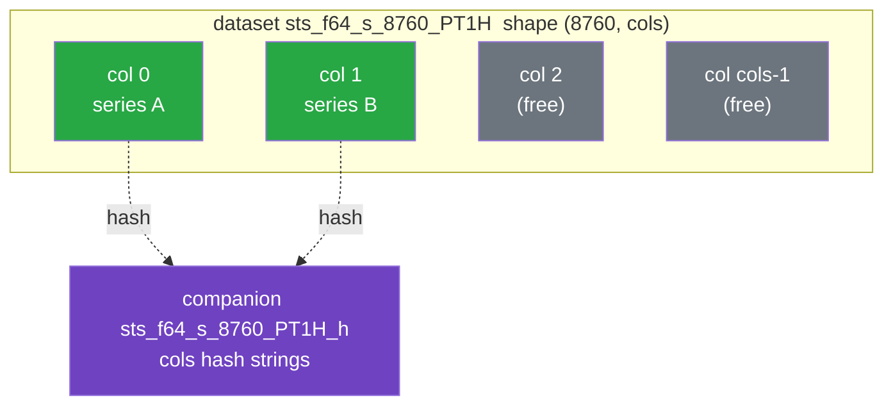

# Storage Model

A persistent store is **two files that travel together**:

```text
system.h5          # HDF5 — the numerical arrays
system.h5.sqlite   # SQLite  — the metadata associations
```

The catalog path is derived by appending `.sqlite` to the HDF5 file name. This page explains the
split and how the two halves stay consistent. For the exact bytes, dataset names, and table columns,
see the [On-Disk File Format reference](../reference/file-format.md).

## Why Split Arrays From Metadata

Arrays and metadata pull in opposite directions:

| Concern        | Arrays                                            | Metadata                                  |
| -------------- | ------------------------------------------------- | ----------------------------------------- |
| Size           | Large (thousands of values each)                  | Small (a row plus a shared feature set)   |
| Access pattern | Bulk read by content                              | Filtered queries by owner, name, features |
| Mutation       | Immutable; whole-array add/delete, dedup-on-write | Insert / delete with constraints          |
| Best tool      | HDF5 (chunked, compressed)                        | SQLite (indexes, transactions)            |

Forcing both into one format would compromise one of them. Instead, each lives where it is
strongest, and the `Store` layer coordinates them.

## The Array Side: HDF5

Arrays live under `time_series/single/` in the HDF5 file, in one of **two storage modes**.

Stored arrays are **immutable**: a value array is added or deleted as a whole and is never edited in
place — there is no API to mutate a row, slice, or column of an array already in the store. Changing
data means writing a new array (content-addressed and deduplicated on write) and, if desired,
deleting the old one.

**Packed mode** holds `SingleTimeSeries` (and the backing array of a
`DeterministicSingleTimeSeries`). Arrays that share a `(dtype, element_shape, length, resolution)`
are packed together as columns of one dataset named `sts_{dtype}_{shape}_{length}_{res}`, with shape
`(length, cols, *element_shape)`. The column count `cols` is sized to the batch that created the
dataset (capped so one chunk stays within a byte budget); an incremental, one-at-a-time write path
uses a default width of 1,000:



- **Columns are series, rows are timesteps.** Chunking is `(1, cols, *element_shape)`, so one HDF5
  chunk holds a single timestamp across every column. The layout favors **bulk writes** (a batch
  fills whole chunks in one pass) and **reads across series by timestamp** (one timestamp is one
  chunk). The reverse directions are the slow ones, by design: reading a single series in full
  touches every chunk band, and adding one series at a time rewrites a chunk band per timestep.
- **A companion dataset holds the hashes.** For each packed dataset there is a sibling
  `{dataset}_h`, a `(cols, 64)` array of `u8`; row `i` holds the SHA-256 hex of column `i` as raw
  bytes, or is all-zero if the slot is free. This is the on-disk index the backend rebuilds on open.
- **Datasets spill when full** into `…__1`, `…__2`, and so on — when a batch exceeds the per-dataset
  column cap, or when incremental writes fill a default-width (1,000-column) dataset.
- **Compression is configurable** at store creation and applies to every data variable (packed and
  standalone). The default is DEFLATE (zlib) level 3 with the byte-shuffle filter; you may change
  the level (0–9), disable shuffle, or turn compression off entirely. The choice is recorded in a
  `compression` global attribute and restored when the store is reopened for appends, so later
  writes reuse the same filter. Compression is a storage detail only — arrays decode transparently
  regardless of the filter, so stores written with different settings stay mutually readable and the
  data-format version is unaffected. In-memory stores ignore the setting.

Packed mode holds every **static** series. `SingleTimeSeries` (and the array behind a
`DeterministicSingleTimeSeries`) pool by resolution into `sts_…` datasets; the explicit-time-axis
types (`NonSequentialTimeSeries` and `PersistentTimeSeries`) pool by their _timestamp vector_ into
`nsts_…` datasets, because the chunking is timestamp-major and so only means something for arrays on
a common time axis. Such a series carries that axis explicitly, and the store content-addresses it —
one `tsv_{hash}` dataset of unix milliseconds per distinct axis, in the file's own `timestamps`
group — so the interned hash is the cohort key, which is what lets a `StaticReader` sweep irregular
series the same way it sweeps regular ones.

**Standalone mode** holds the dense forecast arrays (`Deterministic`, `Probabilistic`, `Scenarios`)
and any explicit-time-axis series alone on its axis — a pool spreads one array over `length` chunks,
so a cohort of one is not worth packing. Each is its own typed, multi-dimensional variable
`arr_{hex_hash}` — no column packing and no companion hash (the variable name carries the hash).
Lone irregular series are shaped `[length, *element_shape]` and chunked whole; dense forecasts are
shaped `[H, count, *element_shape]` (with extra leading axes for `Probabilistic` / `Scenarios`) and
chunked in bounded blocks along the `count` (window) axis, so reading one forecast window
decompresses a single block rather than the whole array. The `ForecastReader` caches a block at a
time to match.

The [file-format reference](../reference/file-format.md#hdf5-layout) gives the precise naming and
dimension scheme. Nothing on the array side distinguishes a forecast from a static series of the
same physical shape — the type, timestamps, and windowing parameters all live in metadata.

## The Metadata Side: SQLite

The catalog holds six tables. The first four describe time series; the last two record relationships
between catalog entities and have nothing to do with time series at all.

- **`time_series_associations`** — one row per
  `(owner_id, owner_category, time_series_type, name, resolution, interval, features)` association,
  including the `data_hash` that links it to a packed column or standalone variable, the array
  typing (`dtype`, `element_shape`), the opaque package-owned `application_data` payload, plus
  temporal fields, forecast parameters (`horizon`, `interval`, `count`, `percentiles`), the unit
  descriptors (`units`, `quantity_kind`, `unit_system`), the `time_reference` recording how the
  timestamps were spelled, the `component_field` the values vary over time, and the `features_hash`.
- **`feature_sets`** — the expanded key/value pairs of a feature map, one row per key, typed by a
  `value_kind` discriminator. The table is **content-addressed**, exactly as arrays are: its primary
  key is `(features_hash, key)` — the same hash the association row already carries, so no join
  column is needed. A feature set is therefore stored **once and shared** by every association whose
  hash matches, not copied per association; an empty map stores no rows at all. Because the rows are
  shared, there is deliberately no foreign key to `time_series_associations` and no
  `ON DELETE CASCADE` (see [Compaction](#compaction) below).
- **`schema_version`** — a single `version` column holding the catalog schema revision
  (`CATALOG_SCHEMA_REVISION`, currently `2`). Its own contract, independent of the artifact's
  `data_format_version`: a catalog change the idempotent DDL cannot make to an existing table needs
  a revision bump and an append-only migration. A catalog predating the stamp reads as revision `1`.
  See
  [Upgrade a store in place](design-choices.md#upgrade-a-store-in-place-rather-than-bricking-it).
- **`supplemental_attribute_associations`** — which supplemental attributes are attached to which
  components, as `(component_id, component_type, attribute_id, attribute_type)`. Identity is the
  `(component_id, attribute_id)` pair.
- **`parent_child_associations`** — directed edges between components, as
  `(parent_id, parent_type, child_id, child_type)`. Identity is the _ordered_
  `(parent_id, child_id)` pair.

The last two are described in
[Associations Between Entities](./data-model.md#associations-between-entities). They carry no
foreign keys and no cascade, and they are independent of `time_series_associations` in both
directions: removing a time series never touches them, and removing an association never touches a
series. They were also added without a `data_format_version` bump, so a store written before they
existed simply gains them on its first writable open — which is why every read of them tolerates the
table being absent.

A unique index over
`(owner_id, owner_category, time_series_type, name, resolution, interval, features_hash)` enforces
the [identity uniqueness](./data-model.md#identity) invariant at the database level.
`owner_category` is part of the key, so a component and a supplemental attribute that share an
`owner_id` are independent; `interval` is part of the key too, so forecasts of one variable that
differ only by interval are distinct. Because SQLite treats `NULL` as distinct in a `UNIQUE` index,
a second index folds `NULL` `resolution` and `interval` to a sentinel so series without them (e.g.
`NonSequentialTimeSeries` and `PersistentTimeSeries`, or any static series, which carry no interval)
are still constrained. Indexes on `data_hash`, `(owner_id, owner_category)`, and `resolution` keep
lookups fast.

## Keeping the Two Files Consistent

Because a write touches both files, `Store` follows a careful ordering so a failure cannot leave a
dangling reference:


- **Array first, metadata second.** `put_array` is idempotent — calling it with an already-present
  hash is a no-op — so staging the array before committing metadata is safe.
- **Metadata commit is the point of no return.** If the SQLite insert fails (most commonly a
  `DuplicateTimeSeries` constraint violation), the transaction rolls back and any array column
  staged _in this call_ is removed, returning the store to its prior state.
- **Bulk writes are all-or-nothing.** `add_time_series_bulk` (and the buffered `bulk_add` session)
  group packed series by shape and stage each group as one batch-sized block — filling whole chunks
  — then insert every association in one transaction; any error rolls the whole batch back and
  removes the staged arrays.

On delete, the order reverses and is reference-counted: the association rows are removed inside a
transaction, then an array column is only zeroed/freed if no remaining association references that
hash. This is what lets two keys [share one array](./content-addressing.md) safely. Feature sets are
shared too, but they are **not** reference-counted — deleting an association never deletes its
feature set; the set is left unreachable for a later `compact()` to sweep.

## Persistence and Copying

The HDF5 backend buffers writes. Call `flush()` (which issues `H5Fflush`) before copying the files
for backup or archival; afterward both `system.h5` and `system.h5.sqlite` can be copied as a pair
without closing the handle. The two files must always be kept together — neither is usable alone.

## Protecting a Saved Artifact

The dangerous moment for a store is not the crash. Every path that writes an artifact stages to a
temporary sibling and renames, so a power loss leaves either the old file or the new one, never a
half-written one. What actually destroys a saved store is an ordinary call aimed at a path that
already holds one.

**Creating over an existing store is refused.** Creating truncates the HDF5 file but only _opens_
the catalog beside it, then stamps both halves with one fresh generation. Left unguarded, a build
script re-run against last week's output produced an empty array file paired with the old catalog's
rows — a store that opens cleanly, reports every series still present, and has nothing behind any of
them. Nothing short of `verify_integrity()` notices. `create` therefore fails with `StoreExists` if
either half is already at the path; the check covers both, because an orphaned catalog poisons fresh
arrays exactly as an orphaned HDF5 file poisons a fresh catalog. Discarding the destination on
purpose is a separate, explicitly named call (`Store::create_replacing`, `overwrite=True` in Python,
`overwrite=true` in Julia), which removes both halves and the catalog's sidecars first.

### Working on a Copy

`open()` defaults to **read-write** in every binding. That is the one place the library will damage
a file you care about: mutations land in the artifact directly, and HDF5 has neither a journal nor a
repair tool, so an interrupted write there is unrecoverable.

`open_copy(src, dest)` copies both halves and opens the copy, leaving the source byte-for-byte
alone. Change the copy, then `persist_to(src)` — the original is only replaced by the final atomic
rename. Both shipped consumers (infrasys and InfrastructureSystems.jl) already work this way; the
call exists so the pattern lives in one place rather than being reimplemented per consumer.

Reserve a read-write `open()` on a user's artifact for when in-place mutation is genuinely what you
mean, and prefer `read_only=True` for anything that only reads.

### One writer, and not on a network filesystem

The store assumes a single writer. On an ordinary filesystem HDF5's file lock enforces most of that
for you — this build links HDF5 2.0 with locking on. But it is configured **best-effort**: where the
filesystem reports that locking is unavailable, HDF5 proceeds without it and says nothing. Lustre,
GPFS, and NFS without `lockd` all land there, and they are exactly where large runs live. SQLite's
WAL journaling is likewise unsafe over NFS.

So: keep a live store on local disk, let one process write it, and copy the finished artifact to
shared storage afterwards. Two concurrent writers on a filesystem without working locks will corrupt
the HDF5 file, and no amount of care inside this library can prevent it.

Inside one process the library enforces the rule itself, and more strictly than the lock does: a
second `Store` on a path that is already open fails with `StoreInUse` whatever its mode, and so do
`create_replacing`, `open_without_catalog`, `persist_to`, and `persist_arrays_to` aimed at a path
another handle holds. A read-only handle is not exempt because its map from content hash to packed
column is built once at open — after the writer removes a series and reuses the slot, that map
points a live hash at another series' values, and libhdf5 sharing one file object between the two
opens makes the reader's cache agree with it. The HDF5 lock does not see this case at all, and it is
the easier mistake to make: an unclosed handle in a notebook or REPL, a fixture and a test body, a
read-only handle opened for a report beside the writer. Close the handle you hold before opening
another.

`verify_integrity()` is the backstop. Every array carries a SHA-256 companion, and the check
re-reads and re-hashes all of them, so corruption is detectable even when it is not preventable —
worth running against an artifact whose history you do not trust. The CLI exposes it as
`infrastore verify`.

## Where the Catalog Lives

The catalog does not have to be the `.sqlite` file while a store is open. `CatalogMode` picks
between two placements, independently of where the arrays live:

| Mode       | Catalog                     | Durability                                  |
| ---------- | --------------------------- | ------------------------------------------- |
| `Attached` | is the `<path>.sqlite` file | every commit, as soon as the OS writes back |
| `InMemory` | held in RAM, loaded on open | only at `persist_to` — a crash loses it     |

`Attached` is the default and what a long-lived on-disk store wants: the CLI mutates one command per
process and relies on each one landing.

The array half has its own moment of durability, because libhdf5 writes its caches back lazily while
a catalog commit lands at once. Every write call that put new arrays into the file flushes it before
committing the rows that name them, so a process killed right after the call returns leaves both
halves agreeing. Inside a transaction the flush is deferred to the outermost commit, and a call that
wrote nothing new (a re-add of content the store already holds) skips it. The flush is not free — a
caller adding series one at a time pays it per call — and a bulk add or a transaction is how to pay
it once for many writes. `InMemory` suits a consumer that builds a store in a scratch directory
beside its own volatile state — a `System` under construction, say. A crash loses that state
regardless, so journaling the scratch catalog buys nothing, and skipping it removes per-commit WAL
and fsync work. Arrays still stream to the HDF5 file, so this does **not** require the data to fit
in memory. Nothing is durable until `persist_to`.

Two caveats. Opening with `InMemory` reads `<path>.sqlite` into RAM but still opens the HDF5 half
**in place**, so mutations land in the original file; a caller that means to leave the source
untouched until an explicit save wants `open_copy` (see [Working on a Copy](#working-on-a-copy)).
And a scratch store that never reached its first save is a half-artifact: a stamped HDF5 file with
no catalog. Reopening it as `Attached` creates a fresh, unstamped catalog beside it, and the
[paired stamp](#saving-one-pair-two-renames) rejects that combination — which is the right answer,
because the arrays are there but nothing names them.

`persist_catalog()` is the cheap way to land an in-memory catalog when the arrays are already in
their final place. `persist_to` aimed at another path has to write the arrays again;
`persist_catalog` writes only the `.sqlite` half, stamped to match the HDF5 file already sitting
beside it. That is what makes `InMemory` usable for what it is good for — skipping per-commit
journaling during a bulk load — without paying a full copy of the arrays to land the result. It is a
checkpoint, not a mode switch: the catalog stays in RAM, and later changes are again RAM-only until
the next call.

## Saving: One Pair, Two Renames

`persist_to` writes both halves to temporary siblings, fsyncs them, and only then renames them into
place, so a crash before the first rename leaves the destination untouched.

The renames cannot be made atomic together — POSIX renames one path at a time. A **generation
stamp** covers the gap: each save mints a fresh value and writes it into both the HDF5
`catalog_generation` root attribute and the catalog's `catalog_identity` table. A crash between the
two renames therefore leaves halves whose stamps disagree, and the next `open` fails with
`MismatchedArtifact` instead of reading a store that quietly contradicts itself. The same check
catches one half being copied without the other.

What the stamp does _not_ give you is a destination that survives a failed save. The renames replace
the target, so a crash between them destroys whatever pair was there before. That is a deliberate
trade — loud, detectable loss beats silent corruption. **Do not assume the destination is intact
after a failed `persist_to`**; recover by saving again from the store, which is still live and
unchanged.

A store written before the stamp existed carries neither half of it. That is the one legitimate
unstamped state, and it opens. **One** stamped half is not: every path that writes a stamp writes
both halves together (`create`, `persist_to`, and `compact`, which carries the existing one across),
so a lone stamp means a half was replaced, copied, or created without its partner. It is rejected as
a mismatch, which closes the migration-window hole where a save interrupted between its two renames,
onto a destination predating the stamp, would otherwise have paired new arrays with an old catalog
in silence.

Each save stages through a sibling named uniquely to itself (`<target>.persist-<tag>`). A fixed name
would be a corruption vector rather than a convenience: nothing locks a `persist_to`
**destination**, so two processes saving to one path would each clear the other's in-flight temp
while the stamping and rename that follow still resolve that name — publishing a partially written
file as a finished save. The cost of uniqueness is that an interrupted save's temps are no longer
swept by the next one; a temp belonging to a live concurrent save cannot be told apart from an
abandoned one, so they are left for you to delete once no save is in flight.

The swap also clears any `-wal`/`-shm` sidecar beside the destination catalog. A sidecar there
belongs to the catalog being replaced — a writer that crashed at that path leaves one — and SQLite
would recover it over the database renamed into its place, resurrecting the replaced catalog's pages
so the save silently would not take.

Saving an `Attached` store onto **its own path** is a no-op: the destination already is that store,
and the flush at the start of `persist_to` has made it durable. The `InMemory` counterpart is real
work rather than a no-op — the arrays are already at `path` and the save is what writes the catalog
beside them, which is exactly the scratch-directory workflow.

Compaction rewrites only the HDF5 half, so it carries the existing stamp into the rewritten file
rather than minting a new one — a fresh stamp there would manufacture exactly the mismatch the stamp
exists to detect.

## Compaction

`compact()` reclaims space in both halves of the artifact, and the two halves behave differently.

**On the array side, compaction rewrites the file.** Deleting a series frees its column slot (reused
transparently by the next compatible write, via `first_free`) or unlinks its standalone dataset, but
HDF5 cannot hand either back to the filesystem in place, so neither shrinks the `.h5`. Compaction
therefore materializes every array the catalog still references into a fresh sibling file and
renames it over the original, reopening the store on the result. What does not survive the trip:
freed slots, datasets nothing references, and the slack in packed pools sized for growth rather than
for the cohort actually stored. The report says how much went — `slots_reclaimed`,
`datasets_dropped`, and `bytes_reclaimed` (how much smaller the file got).

Because the file is replaced, compaction assumes the compacting process is its only user. That is
the store's single-writer model in general; the difference is that here a concurrent reader on Unix
silently keeps reading the pre-compaction file, and on Windows the rename fails outright.

**Compaction also sweeps the shared sets.** Because feature sets and timestamp vectors are shared,
deleting an association cannot cascade into them: removing the last association that referenced one
leaves it unreachable. `compact()` deletes both — the feature set as a catalog row, the timestamp
vector as an unlinked dataset — and reports the counts as `feature_sets_reclaimed` and
`timestamp_sets_reclaimed`, before the rewrite, so the rewrite's liveness scan sees what survived.
(Clearing is the exception on both counts: it orphans every feature set and every axis by
construction, so it reclaims them outright rather than waiting for a compaction a cleared store may
never get.)

See [`compact`](../reference/rust-api.md#store).
