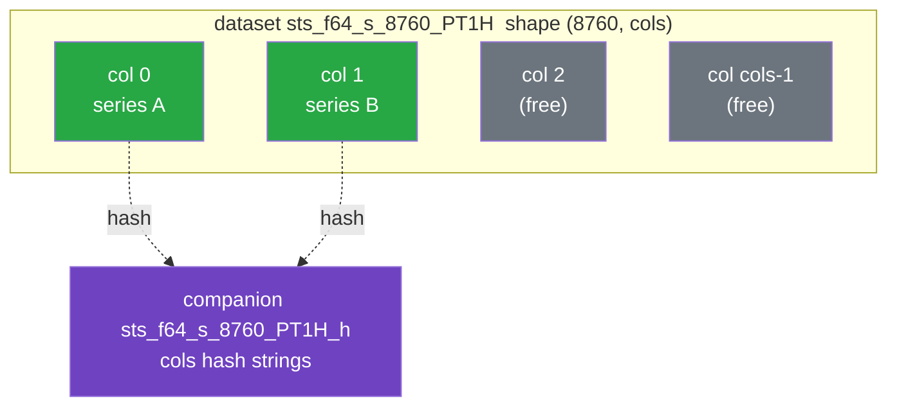
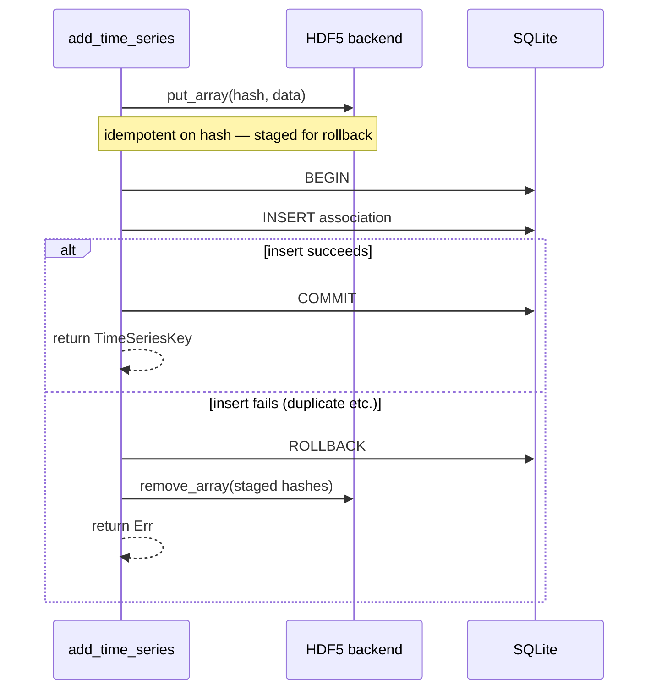

# Storage Model

A persistent store is **two files that travel together**:

```text
system.h5          # HDF5 — the numerical arrays
system.h5.sqlite   # SQLite  — the metadata associations
```

The catalog path is derived by appending `.sqlite` to the HDF5 file name. This page explains the
split and how the two halves stay consistent. For the exact bytes, dataset names, and table columns,
see the [On-Disk File Format reference](../reference/file-format.md).

## Why Split Arrays From Metadata

Arrays and metadata pull in opposite directions:

| Concern        | Arrays                                            | Metadata                                  |
| -------------- | ------------------------------------------------- | ----------------------------------------- |
| Size           | Large (thousands of values each)                  | Small (a row plus a shared feature set)   |
| Access pattern | Bulk read by content                              | Filtered queries by owner, name, features |
| Mutation       | Immutable; whole-array add/delete, dedup-on-write | Insert / delete with constraints          |
| Best tool      | HDF5 (chunked, compressed)                        | SQLite (indexes, transactions)            |

Forcing both into one format would compromise one of them. Instead, each lives where it is
strongest, and the `Store` layer coordinates them.

## The Array Side: HDF5

Arrays live under `time_series/single/` in the HDF5 file, in one of **two storage modes**.

Stored arrays are **immutable**: a value array is added or deleted as a whole and is never edited in
place — there is no API to mutate a row, slice, or column of an array already in the store. Changing
data means writing a new array (content-addressed and deduplicated on write) and, if desired,
deleting the old one.

**Packed mode** holds `SingleTimeSeries` (and the backing array of a
`DeterministicSingleTimeSeries`). Arrays that share a `(dtype, element_shape, length, resolution)`
are packed together as columns of one dataset named `sts_{dtype}_{shape}_{length}_{res}`, with shape
`(length, cols, *element_shape)`. The column count `cols` is sized to the batch that created the
dataset (capped so one chunk stays within a byte budget); an incremental, one-at-a-time write path
uses a default width of 1,000:



- **Columns are series, rows are timesteps.** Chunking is `(1, cols, *element_shape)`, so one HDF5
  chunk holds a single timestamp across every column. The layout favors **bulk writes** (a batch
  fills whole chunks in one pass) and **reads across series by timestamp** (one timestamp is one
  chunk). The reverse directions are the slow ones, by design: reading a single series in full
  touches every chunk band, and adding one series at a time rewrites a chunk band per timestep.
- **A companion dataset holds the hashes.** For each packed dataset there is a sibling
  `{dataset}_h`, a `(cols, 64)` array of `u8`; row `i` holds the SHA-256 hex of column `i` as raw
  bytes, or is all-zero if the slot is free. This is the on-disk index the backend rebuilds on open.
- **Datasets spill when full** into `…__1`, `…__2`, and so on — when a batch exceeds the per-dataset
  column cap, or when incremental writes fill a default-width (1,000-column) dataset.
- **Compression is configurable** at store creation and applies to every data variable (packed and
  standalone). The default is DEFLATE (zlib) level 3 with the byte-shuffle filter; you may change
  the level (0–9), disable shuffle, or turn compression off entirely. The choice is recorded in a
  `compression` global attribute and restored when the store is reopened for appends, so later
  writes reuse the same filter. Compression is a storage detail only — arrays decode transparently
  regardless of the filter, so stores written with different settings stay mutually readable and the
  data-format version is unaffected. In-memory stores ignore the setting.

Packed mode holds every **static** series. `SingleTimeSeries` (and the array behind a
`DeterministicSingleTimeSeries`) pool by resolution into `sts_…` datasets; `NonSequentialTimeSeries`
pool by their _timestamp vector_ into `nsts_…` datasets, because the chunking is timestamp-major and
so only means something for arrays on a common time axis. An irregular series carries that axis
explicitly, and the catalog already content-addresses it, so the interned hash is the cohort key —
which is what lets a `StaticReader` sweep irregular series the same way it sweeps regular ones.

**Standalone mode** holds the dense forecast arrays (`Deterministic`, `Probabilistic`, `Scenarios`)
and any `NonSequentialTimeSeries` alone on its time axis — a pool spreads one array over `length`
chunks, so a cohort of one is not worth packing. Each is its own typed, multi-dimensional variable
`arr_{hex_hash}` — no column packing and no companion hash (the variable name carries the hash).
Lone irregular series are shaped `[length, *element_shape]` and chunked whole; dense forecasts are
shaped `[H, count, *element_shape]` (with extra leading axes for `Probabilistic` / `Scenarios`) and
chunked in bounded blocks along the `count` (window) axis, so reading one forecast window
decompresses a single block rather than the whole array. The `ForecastReader` caches a block at a
time to match.

The [file-format reference](../reference/file-format.md#hdf5-layout) gives the precise naming and
dimension scheme. Nothing on the array side distinguishes a forecast from a static series of the
same physical shape — the type, timestamps, and windowing parameters all live in metadata.

## The Metadata Side: SQLite

The catalog holds six tables. The first four describe time series; the last two record relationships
between catalog entities and have nothing to do with time series at all.

- **`time_series_associations`** — one row per
  `(owner_id, owner_category, time_series_type, name, resolution, interval, features)` association,
  including the `data_hash` that links it to a packed column or standalone variable, the array
  typing (`dtype`, `element_shape`), the opaque package-owned `ext` payload, plus temporal fields,
  forecast parameters (`horizon`, `interval`, `count`, `percentiles`), units, and the
  `features_hash`.
- **`feature_sets`** — the expanded key/value pairs of a feature map, one row per key, typed by a
  `value_kind` discriminator. The table is **content-addressed**, exactly as arrays are: its primary
  key is `(features_hash, key)` — the same hash the association row already carries, so no join
  column is needed. A feature set is therefore stored **once and shared** by every association whose
  hash matches, not copied per association; an empty map stores no rows at all. Because the rows are
  shared, there is deliberately no foreign key to `time_series_associations` and no
  `ON DELETE CASCADE` (see [Compaction](#compaction) below).
- **`schema_version`** — a single `version` column holding the catalog schema version (currently
  `1`).
- **`supplemental_attribute_associations`** — which supplemental attributes are attached to which
  components, as `(component_id, component_type, attribute_id, attribute_type)`. Identity is the
  `(component_id, attribute_id)` pair.
- **`parent_child_associations`** — directed edges between components, as
  `(parent_id, parent_type, child_id, child_type)`. Identity is the _ordered_
  `(parent_id, child_id)` pair.

The last two are described in
[Associations Between Entities](./data-model.md#associations-between-entities). They carry no
foreign keys and no cascade, and they are independent of `time_series_associations` in both
directions: removing a time series never touches them, and removing an association never touches a
series. They were also added without a `data_format_version` bump, so a store written before they
existed simply gains them on its first writable open — which is why every read of them tolerates the
table being absent.

A unique index over
`(owner_id, owner_category, time_series_type, name, resolution, interval, features_hash)` enforces
the [key uniqueness](./data-model.md#keys) invariant at the database level. `owner_category` is part
of the key, so a component and a supplemental attribute that share an `owner_id` are independent;
`interval` is part of the key too, so forecasts of one variable that differ only by interval are
distinct. Because SQLite treats `NULL` as distinct in a `UNIQUE` index, a second index folds `NULL`
`resolution` and `interval` to a sentinel so series without them (e.g. `NonSequentialTimeSeries`, or
any static series, which carry no interval) are still constrained. Indexes on `data_hash`,
`(owner_id, owner_category)`, and `resolution` keep lookups fast.

## Keeping the Two Files Consistent

Because a write touches both files, `Store` follows a careful ordering so a failure cannot leave a
dangling reference:



- **Array first, metadata second.** `put_array` is idempotent — calling it with an already-present
  hash is a no-op — so staging the array before committing metadata is safe.
- **Metadata commit is the point of no return.** If the SQLite insert fails (most commonly a
  `DuplicateTimeSeries` constraint violation), the transaction rolls back and any array column
  staged _in this call_ is removed, returning the store to its prior state.
- **Bulk writes are all-or-nothing.** `add_time_series_bulk` (and the buffered `bulk_add` session)
  group packed series by shape and stage each group as one batch-sized block — filling whole chunks
  — then insert every association in one transaction; any error rolls the whole batch back and
  removes the staged arrays.

On delete, the order reverses and is reference-counted: the association rows are removed inside a
transaction, then an array column is only zeroed/freed if no remaining association references that
hash. This is what lets two keys [share one array](./content-addressing.md) safely. Feature sets are
shared too, but they are **not** reference-counted — deleting an association never deletes its
feature set; the set is left unreachable for a later `compact()` to sweep.

## Persistence and Copying

The HDF5 backend buffers writes. Call `flush()` (which issues `H5Fflush`) before copying the files
for backup or archival; afterward both `system.h5` and `system.h5.sqlite` can be copied as a pair
without closing the handle. The two files must always be kept together — neither is usable alone.

## Compaction

`compact()` reclaims space in both halves of the artifact, and the two halves behave differently.

**On the array side, compaction rewrites the file.** Deleting a series frees its column slot (reused
transparently by the next compatible write, via `first_free`) or unlinks its standalone dataset, but
HDF5 cannot hand either back to the filesystem in place, so neither shrinks the `.h5`. Compaction
therefore materializes every array the catalog still references into a fresh sibling file and
renames it over the original, reopening the store on the result. What does not survive the trip:
freed slots, datasets nothing references, and the slack in packed pools sized for growth rather than
for the cohort actually stored. The report says how much went — `slots_reclaimed`,
`datasets_dropped`, and `bytes_reclaimed` (how much smaller the file got).

Because the file is replaced, compaction assumes the compacting process is its only user. That is
the store's single-writer model in general; the difference is that here a concurrent reader on Unix
silently keeps reading the pre-compaction file, and on Windows the rename fails outright.

**On the catalog side, compaction sweeps.** Because feature sets are shared, deleting an association
cannot cascade into them: removing the last association that referenced a set leaves it unreachable.
`compact()` deletes those rows and reports the count as `feature_sets_reclaimed` (and
`timestamp_sets_reclaimed` for timestamp vectors), before the rewrite, so the rewrite's liveness
scan sees the swept catalog. (Clearing the whole store is the exception that needs no sweep: it
orphans every set by construction, so it drops them all outright.)

See [`compact`](../reference/rust-api.md#store).
