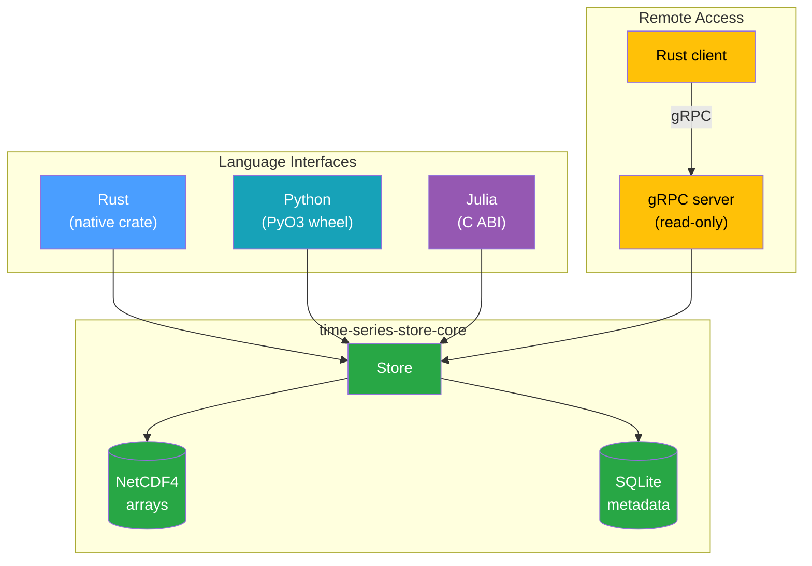

# Introduction

**time-series-store** is a Rust library for managing time-series data in power-systems and energy
simulations. It separates persistence into two concerns: numerical arrays are stored in NetCDF4,
while the metadata that associates each array with an owning component lives in SQLite. Identical
arrays are stored once and shared through content addressing.

The library ships native Rust, Python (via PyO3), and Julia (via a C ABI) interfaces, plus a
read-only gRPC server and Rust client.

## Key Features

- **One array, stored once** — Arrays are addressed by a SHA-256 content hash, so identical series
  shared across components are written to disk a single time
  ([content addressing](./explanation/content-addressing.md))
- **NetCDF4 for arrays, SQLite for metadata** — Numerical data lands in a compact, chunked NetCDF4
  file; queryable associations live in a sidecar SQLite database
  ([storage model](./explanation/storage-model.md))
- **Feature-tagged associations** — Each association carries an arbitrary map of typed features
  (`int` / `float` / `bool` / `str`) so multiple variants of a series can coexist under one owner
- **Three language bindings** — Use it from Rust, Python, or Julia with the same on-disk format
- **Read-only gRPC service** — Serve a store over the network for remote readers, with optional
  API-key authentication
- **Designed for power-systems data** — The data model maps onto
  [InfrastructureSystems.jl](https://github.com/NREL-Sienna/InfrastructureSystems.jl) owners,
  categories, and time-series concepts

## v0 Scope

This release implements **`SingleTimeSeries`** — a one-dimensional array sampled at a fixed
resolution — end to end across every interface. The five other time-series types
(`NonSequentialTimeSeries`, `Deterministic`, `DeterministicSingleTimeSeries`, `Probabilistic`,
`Scenarios`) have reserved slots in the metadata schema and the `TimeSeriesType` enum so they can
land later without breaking the on-disk format. See [Data Model](./explanation/data-model.md) for
the full picture.

## Who Should Read This

| Audience                        | Start here                                        |
| ------------------------------- | ------------------------------------------------- |
| **Python package developers**   | [Python Developer Guide](./guides/python.md)      |
| **Julia package developers**    | [Julia Developer Guide](./guides/julia.md)        |
| **Rust developers**             | [Rust Developer Guide](./guides/rust.md)          |
| **Anyone deploying the server** | [gRPC Server & Client](./guides/server.md)        |
| **Tooling & forensics**         | [On-Disk File Format](./reference/file-format.md) |

## Next Steps

- **Setting up?** Start with [Installation](./getting-started/installation.md).
- **Want the 60-second tour?** Read the [Quick Start](./getting-started/quick-start.md).
- **Want to understand how it works?** Read the [Architecture](./explanation/architecture.md).
- **Need exact bytes on disk?** See the [On-Disk File Format](./reference/file-format.md).
