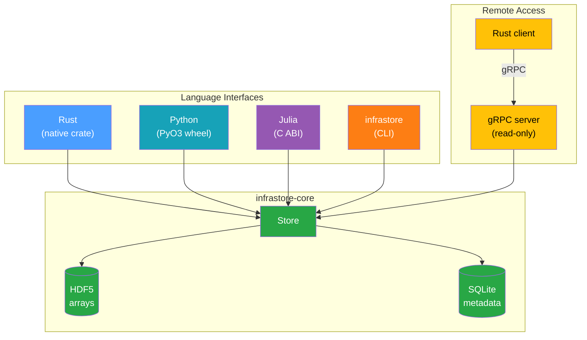

# Introduction

**infrastore** is a Rust library for managing time-series data in power-systems and energy
simulations. It separates persistence into two concerns: numerical arrays are stored in HDF5, while
the metadata that associates each array with an owning component lives in SQLite. Identical arrays
are stored once and shared through content addressing.

The library ships native Rust, Python (via PyO3), and Julia (via a C ABI) interfaces, plus the
`infrastore` command-line tool and a read-only gRPC server with a Rust client.

## Key Features

- **One array, stored once** — Arrays are addressed by a SHA-256 content hash, so identical series
  shared across components are written to disk a single time
  ([content addressing](./explanation/content-addressing.md))
- **HDF5 for arrays, SQLite for metadata** — Numerical data lands in a compact, chunked HDF5 file;
  queryable associations live in a catalog SQLite database
  ([storage model](./explanation/storage-model.md))
- **Feature-tagged associations** — Each association carries an arbitrary map of typed features
  (`int` / `float` / `bool` / `str`) so multiple variants of a series can coexist under one owner
- **Typed, N-dimensional arrays** — Store `f64`, `f32`, `i64`, `i32`, `u64`, or `bool` values, with
  an optional per-step element shape (e.g. the coefficient tuple of a cost curve)
- **Three language bindings** — Use it from Rust, Python, or Julia with the same on-disk format
- **An `infrastore` command-line tool** — Load time series from CSV, and list, read, export, plot,
  diff, and inspect a store straight from a terminal, with `table` / `json` / `jsonl` / `csv` output
  ([CLI how-to](./how-to/use-cli.md))
- **Read-only gRPC service** — Serve a store over the network for remote readers, with optional
  API-key authentication
- **Designed for power-systems data** — The data model maps onto
  [InfrastructureSystems.jl](https://github.com/NREL-Sienna/InfrastructureSystems.jl) and
  [infrasys](https://github.com/NatLabRockies/infrasys) owners, categories, and time-series concepts

## Who Should Read This

| Audience                           | Start here                                             |
| ---------------------------------- | ------------------------------------------------------ |
| **Developers of a package on top** | [Embedding in a Parent Package](./guides/embedding.md) |
| **Python package developers**      | [Python Developer Guide](./guides/python.md)           |
| **Julia package developers**       | [Julia Developer Guide](./guides/julia.md)             |
| **Rust developers**                | [Rust Developer Guide](./guides/rust.md)               |
| **Command-line users**             | [Use the `infrastore` CLI](./how-to/use-cli.md)        |
| **Anyone deploying the server**    | [gRPC Server & Client](./guides/server.md)             |
| **Tooling & forensics**            | [On-Disk File Format](./reference/file-format.md)      |

## Next Steps

- **Setting up?** Start with [Installation](./getting-started/installation.md).
- **Want the 60-second tour?** Read the Quick Start for
  [Python](./getting-started/quick-start-python.md) or
  [Julia](./getting-started/quick-start-julia.md). Rust users can go straight to the
  [Rust Developer Guide](./guides/rust.md).
- **Want to understand how it works?** Read the [Architecture](./explanation/architecture.md).
- **Need exact bytes on disk?** See the [On-Disk File Format](./reference/file-format.md).
